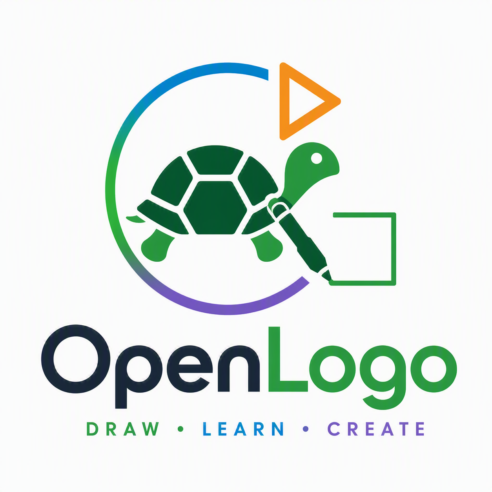

<p align="center">
  
</p>

# OpenLogo
An Open Version of Logo

## Specification

OpenLogo (short name **OL**) is a modern educational Logo-family language using the **`.logo`** extension.

Start with the [OpenLogo specification](spec/README.md). OpenLogo is licensed under the [MIT License](LICENSE).

## Getting Started

**Prerequisites:** Node.js `>=22` and npm.

**Install & build:**

```bash
npm install
npm run build
```

(`npm ci` also works — it installs from the committed `package-lock.json`, same as CI.)

**Run the checks** (prove it works):

```bash
npm test             # unit tests
npm run conformance  # stack-neutral source → events/diagnostics fixtures
npm run coverage     # 100% line/branch/function coverage gate
npm run examples     # runs the spec/examples/*.logo programs
```

**Try a program:** the canonical square —

```
repeat 4 [ forward 100 right 90 ]
```

Run it interactively in `@openlogo/studio`, the browser IDE (editor + Canvas turtle view + Run):

```bash
npm run dev
```

Then open the printed local URL, type the program above into the editor, and press **Run** — a
square draws on the Canvas. See [`packages/studio`](packages/studio) for details.


**Repo map:** see [`packages/README.md`](packages/README.md) for the package layout and
[`docs/`](docs/) for architecture, ADRs, and delivery docs.
