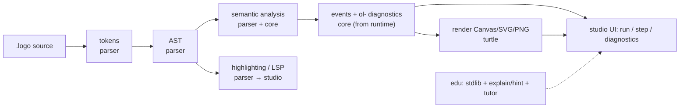

# OpenLogo architecture & monorepo definition

> How the OpenLogo (OL) TypeScript 7 monorepo is structured, how the packages fit together, and the
> cross-cutting contracts (AST, syntax highlighting, events, diagnostics, LSP, rendering, UI) that
> let the domains be built **in parallel**. Decisions are recorded in [`adr/`](adr/); the normative
> language contract is [`../spec/`](../spec/README.md).

## 1. Overview

OpenLogo is one monorepo. Six `@openlogo/*` packages implement the spec; a shared set of
**cross-cutting contracts** defines the seams between them so seven domain teams (agents) can work
concurrently. Build order follows the spec's profile DAG: **Core Language → Turtle & Rendering**
(minimal conformance) first.

## 2. Repository layout

```text
openlogo/
├─ spec/                     Normative language contract (maintainer-owned)
├─ docs/
│  ├─ adr/                   Architecture Decision Records
│  ├─ architecture.md        This document
│  └─ delivery.md            Release + milestone strategy
├─ packages/
│  ├─ core/                  @openlogo/core   — values, diagnostics, events, profile metadata
│  ├─ parser/               @openlogo/parser — lexer, reader, grammar, AST, highlighting, lints
│  ├─ runtime/              @openlogo/runtime — evaluator, scope, procedures, control, places
│  ├─ turtle/                @openlogo/turtle  — turtle/sprite state, rendering, animation, export
│  ├─ studio/               @openlogo/studio — editor/REPL, run/step, diagnostics UI, LSP, lessons
│  └─ edu/                  @openlogo/edu    — levels, explain/hint, geometry stdlib, tutor, curriculum
├─ tests/
│  └─ conformance/           Stack-neutral source → events/diagnostics fixtures (by profile)
├─ .github/
│  ├─ agents/                The 12 OpenLogo agents
│  ├─ skills/                Agent skill playbooks (shared + per-agent)
│  ├─ instructions/          Team agreement + per-package (packages/<name>/**) rules
│  ├─ ISSUE_TEMPLATE/        Issue forms (epic, user-story, conformance, foundation, bug, docs, request)
│  ├─ labeler.yml            Path→label rules  ·  labels.yml  Label taxonomy manifest
│  ├─ scripts/               Metadata validation + label sync
│  └─ workflows/             CI (Definition of Done), labeler, label sync — @devops
├─ AGENTS.md                 Front door for any agent tool
├─ package.json              Workspace root (manager TBD — see ADR-0001)
├─ tsconfig.base.json        Shared strict TS7 config
└─ tsconfig.json             Project references over packages/*
```

Each package is a workspace member with `package.json`, a `tsconfig.json` that extends
`tsconfig.base.json`, a single public entry `src/index.ts`, and co-located tests. Nothing imports
another package's internals — only its `src/index.ts` (`OL` namespace). See
[`.github/skills/shared/ts7-package/SKILL.md`](../.github/skills/shared/ts7-package/SKILL.md).

**Where the source lives & folder-scoped instructions.** The source root of each package is
`packages/<name>/src/` — [`packages/README.md`](../packages/README.md) is the source-folder map. Each
package also has a **scoped working agreement** at `.github/instructions/<name>.instructions.md`
(`applyTo: "packages/<name>/**"`) that inherits the always-on team agreement and pins that package's
responsibilities, spec files, boundaries, and conventions.

## 3. Package definitions

| Package | Purpose | Depends on | Owning agent(s) |
|---|---|---|---|
| `@openlogo/core` | value/type model, `ol-*` diagnostic registry, trace/event registry, profile/feature-detection metadata | — | interpreter |
| `@openlogo/parser` | lexer, reader, EBNF grammar, **AST**, reserved words, **syntax highlighting** classes, **syntax + semantic checker** (parse/semantic/style lints) | core | language-designer, interpreter |
| `@openlogo/runtime` | evaluator, scoping, procedures, control forms, comprehensions, places/mutation, equality, execution budget | core, parser | interpreter |
| `@openlogo/turtle` | turtle/sprite state, pen/heading/shape, **rendering** (Canvas/SVG/PNG), animation, stepping, export, a11y | core | turtle-engine |
| `@openlogo/studio` | **browser web app**: editor/REPL, Canvas turtle view, Run/Stop/Reset, diagnostics view, **LSP**, lesson pane, persistence, a11y | core, parser, runtime, turtle, edu | learner-experience |
| `@openlogo/edu` | learner levels, `explain`/`why`/`hint`/`debug`, geometry stdlib (`.logo`), AI tutor, curriculum, examples | core, runtime | geometry-teacher, ai-tutor, curriculum |

### Suggested module layout (KISS — not a straitjacket)

- **core/src**: `values.ts`, `diagnostics.ts` (`ol-*` registry), `events.ts` (trace/event types +
  registry), `profiles.ts` (feature metadata), `index.ts`.
- **parser/src**: `tokens.ts`, `reader.ts`, `grammar.ts`, `ast.ts` (nodes + factory + visitor),
  `highlight.ts` (token classification), `check.ts` (parse/semantic/style checker), `index.ts`.
- **runtime/src**: `evaluator.ts`, `scope.ts`, `procedures.ts`, `control.ts`, `comprehensions.ts`,
  `places.ts`, `equality.ts`, `budget.ts`, `index.ts`.
- **turtle/src**: `state.ts`, `scene.ts`, `canvas.ts`, `svg.ts`, `png.ts`, `animation.ts`,
  `a11y.ts`, `index.ts` (flat — no `render/` subfolder).
- **studio/src**: `app.ts`, `editor/`, `repl.ts`, `run-controller.ts`, `diagnostics-view.ts`,
  `lsp/`, `lesson-pane.ts`, `persistence.ts`, `index.ts`.
- **edu/src**: `levels.ts`, `concepts.ts`, `meta/` (explain/why/hint/debug), `geometry/` (`.logo` +
  reasoning), `tutor/` (adapter + socratic), `curriculum/`, `index.ts`.

## 4. Cross-cutting contracts (the seams)

These are the shared interfaces between packages. **They are agreed first, then domains build against
them in parallel.** Any change is a serialized, one-PR change reviewed by the owning agent(s).

| Contract | Defined in | Produced by | Consumed by | Shape / rule |
|---|---|---|---|---|
| **AST** | `parser/src/ast.ts` | parser | runtime, studio (LSP), docs | Nodes mirror grammar productions; every node carries a `source_span`; immutable; a visitor/walker is provided. Co-owned language-designer + interpreter. See `interpreter/ast-design`. |
| **Token classes / syntax highlighting** | `parser/src/highlight.ts` | parser | studio editor, docs, external editors | The 15 normative token classes from `spec/tooling.md`, classified from the **grammar** (not regex); case-insensitive keywords; grammatical position decides the class. Owner language-designer; renderer learner-experience. See `language-designer/syntax-highlighting`. |
| **Trace / event stream** | `core/src/events.ts` | runtime | turtle (render), studio (step), tests | Deterministic, ordered, headless events with the `seq`/`kind`/`source-span`/`turtle-id`/`payload` envelope and registered kinds (`instruction`, `move`, `draw-segment`, …). No timing/frames in the stream. See `turtle-engine/turtle-event-contract`. |
| **Diagnostics** | `core/src/diagnostics.ts` | parser, runtime | studio (UI), tests, tutor | Normative `ol-*` shape: code, span, params, message, stage, severity, did-you-mean. Never ad-hoc strings. See `shared/diagnostics`. |
| **LSP / tooling** | `studio/src/lsp` | studio | editors | Built from parser (tokens, AST, lints) + core (diagnostics): highlight, hover, diagnostics, completion. Informative in the spec; must stay grammar-faithful. |
| **Rendering** | `turtle/src/{canvas,svg,png}.ts` | turtle | studio | Consumes events → Canvas (required — the live **browser** surface), SVG/PNG (export). Deterministic export; honors reduced-motion, keyboard, non-visual descriptions (`spec/rendering.md`). |
| **Studio UI / state** | `studio/src` | studio | learner | Composes editor + turtle view + diagnostics + lesson pane over a single state model (source, run-state, diagnostics, turtle frame). Run/Stop/Reset drive the runtime budget. See `learner-experience/studio-ui`. |

## 5. How it all fits



The **AST**, **events**, **diagnostics**, and **token classes** are the four contracts every other
box depends on — fix them first and the rest proceed independently.

## 6. Parallelization map

Because the seams above are explicit, these **domain tracks run concurrently**; they synchronize only
at the shared contracts and at milestone integration (see [`delivery.md`](delivery.md)).

| Track | Agent | Package(s) | Builds independently once contracts are set | Sync points |
|---|---|---|---|---|
| Language & grammar | language-designer | parser | grammar, tokens, reserved words | AST + token classes |
| Engine | interpreter | core, parser, runtime | evaluator, scoping, values, diagnostics, events | AST + events + diagnostics |
| Highlighter / tooling | language-designer + learner-experience | parser, studio | token classification, LSP | token classes (tracks grammar version) |
| Rendering | turtle-engine | turtle | turtle state, Canvas/SVG/PNG, animation | events |
| Studio / UI | learner-experience | studio | editor, run loop, diagnostics view, lessons pane | AST, events, diagnostics |
| Education | geometry-teacher, ai-tutor, curriculum | edu | geometry stdlib, explain/hint, tutor, lessons | runtime API + diagnostics |
| Quality | testing | tests/ | conformance fixtures, fuzz/stability test suites | all contracts |
| Platform / DevSecOps | devops | `.github/workflows/`, labeler, scripts | CI gates, security scanning, labeler + label sync, releases | Definition of Done (all contracts) |
| Docs | documentation | docs/ | reference, tutorials, examples | grammar + commands |

**Contract-first rule:** before a milestone's parallel work fans out, the affected contracts (AST
nodes, event types, `ol-*` codes, token classes) are added/agreed in one serialized PR. Then each
track builds against them without blocking the others.

## 7. Tooling

Workspace manager, test runner, lint, and bundler are deferred sub-decisions in
[`adr/0001-tech-stack.md`](adr/0001-tech-stack.md); each gets its own ADR and is reflected in
`AGENTS.md` and `shared/definition-of-done` once chosen. CI enforces the Definition of Done
(`.github/workflows/`, owned by `@devops`; test/conformance suites authored by `@testing`).
