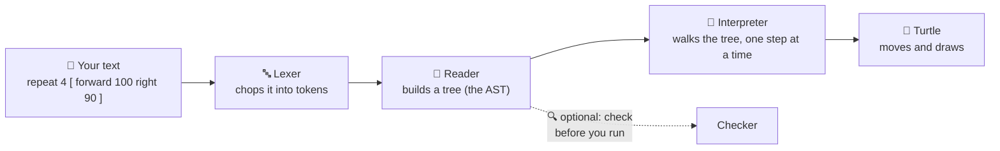

# 01 · The big picture

Let's follow one line of your code on its whole adventure — from the letters you typed to a turtle
moving on screen. Our example for this trip is the classic square:

```
repeat 4 [ forward 100 right 90 ]
```

That one line passes through four little "machines" inside OpenLogo, one after another — plus one
optional helper that can look over the tree without running it:



Here's what each machine does, in plain words:

1. **The lexer** reads your text one character at a time and groups the letters into **tokens** —
   the smallest meaningful pieces, like `repeat`, `4`, `[`, `forward`, `100`. Think of it like
   splitting a sentence into words before you can understand it. A future page in this series digs
   into tokens in detail.
2. **The reader** takes that flat list of tokens and builds a **tree** out of it — a **block** is
   one bundle of instructions grouped together (here, everything between the `[` and `]`). The
   reader nests blocks and instructions inside each other, the way a table of contents nests
   chapters inside a book. This tree has a real name: the **AST** (Abstract Syntax Tree). `forward
   100` becomes one instruction: "move forward, and the amount is 100."
3. **The interpreter** walks the tree branch by branch and actually *does* what each part says.
   Think of it like a cook following a recipe: it reads one step, does exactly that step, then
   moves to the next — never skipping ahead. The engine underneath that keeps track of everything
   while the interpreter works — where the turtle is, what's been drawn so far — is called the
   **runtime**. It's like the kitchen itself: the counters, the pans, the state of everything the
   cook is using.
4. Only once the interpreter reaches a turtle instruction does the **turtle** actually move and
   draw a line.

Off to the side, the **checker** can look over the tree on its own, without running it — the same
way a teacher looks over your outline before you start writing. It's a separate helper, not a
required gate: your code can run without ever asking the checker first.

## What's real today

✅ **Tokenizing and building the tree** — our square example splits into clean tokens and the
reader builds the correct tree, grouping `forward` with `100` and `right` with `90`.

✅ **The turtle actually moves** — this is the big one. Run our square today and OpenLogo really
does draw it: the interpreter walks the tree and the turtle moves forward, turns, moves forward
again, four times over, tracing a real square.

ℹ️ **The checker needs to be told the turtle is in play** — it always knows Core words like
`repeat`, `print`, and `define`. It also knows turtle words like `forward` and `right` — but only
once it's told the turtle vocabulary is active, the same way a spell-checker needs to know you're
writing in French before it stops flagging French words as typos.

## What's next

With the turtle now moving and drawing, the next big adventures are teaching OpenLogo to **explain
its own geometry** — so you can discover *why* a square needs four 90° turns, or how many turns a
five-pointed star needs, instead of being told — and building an **AI tutor** that nudges you
toward the answer instead of just giving it away.

## Try it yourself

Next time you write a turtle program, try reading it out loud one token at a time — `repeat`,
`4`, `[`, `forward`, `100`, `right`, `90`, `]` — the same way OpenLogo's lexer does.

**Next up →** [02 · Tokens](02-tokens.md)
