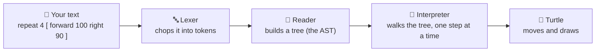

# 01 · The big picture

Let's follow one line of your code on its whole adventure — from the letters you typed to a turtle
moving on screen. Our example for this trip is the classic square:

```
repeat 4 [ forward 100 right 90 ]
```

That one line does four little journeys, one after another, through four "machines" inside
OpenLogo:



Here's what each machine does, in plain words:

1. **The lexer** reads your text one character at a time and groups the letters into **tokens** —
   the smallest meaningful pieces, like `repeat`, `4`, `[`, `forward`, `100`. Think of it like
   splitting a sentence into words before you can understand it. (Page [02](02-tokens.md) is all
   about tokens.)
2. **The reader** takes that flat list of tokens and builds a **tree** out of it — showing which
   pieces belong together. `forward 100` becomes one instruction: "move forward, and the amount is
   100." This tree has a real name: the **AST** (Abstract Syntax Tree). Think of it like an outline
   for an essay — it shows what's nested inside what.
3. **The interpreter** walks the tree branch by branch and actually *does* what each part says —
   this is the **runtime**, the engine that runs your program.
4. Only once the interpreter reaches a turtle instruction does the **turtle** actually move and
   draw a line.

## What's real today, and what's next

We can already prove steps 1 and 2 work, for real, on the actual OpenLogo code: our square example
tokenizes cleanly and builds a clean tree with zero errors. Step 3 (the interpreter) already runs
real OpenLogo programs — printing text, doing math, running loops, calling your own procedures.

Making the *turtle* in step 4 actually move is the next big milestone we're building
(nicknamed "M2" by the team) — that's the payoff this whole pipeline has been built for.

## Try it yourself

Next time you write a turtle program, try reading it out loud one token at a time — `repeat`,
`4`, `[`, `forward`, `100`, `right`, `90`, `]` — the same way OpenLogo's lexer does.

**Next up →** [02 · Tokens](02-tokens.md): what a token actually is, and how OpenLogo makes them.
