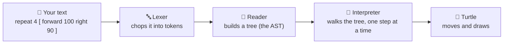

# 01 · The big picture

Let's follow one line of your code on its whole adventure — from the letters you typed to a turtle
moving on screen. Our example for this trip is the classic square:

```
repeat 4 [ forward 100 right 90 ]
```

That one line does four little journeys, one after another, through four "machines" inside
OpenLogo:



Here's what each machine does, in plain words:

1. **The lexer** reads your text one character at a time and groups the letters into **tokens** —
   the smallest meaningful pieces, like `repeat`, `4`, `[`, `forward`, `100`. Think of it like
   splitting a sentence into words before you can understand it. A future page in this series digs
   into tokens in detail.
2. **The reader** takes that flat list of tokens and builds a **tree** out of it — showing which
   pieces belong together. Take `repeat 4 [ … ]`: the reader groups the `4` and the block together
   as "repeat this many times, this block." This tree has a real name: the **AST** (Abstract Syntax
   Tree). Think of it like an outline for an essay — it shows what's nested inside what. Right now,
   `forward 100` itself is still two separate lines in that outline instead of one grouped
   instruction — teaching the reader to fold turtle commands and their numbers together is part of
   the next big step we're building.
3. **The interpreter** walks the tree branch by branch and actually *does* what each part says.
   Think of it like a cook following a recipe: it reads one step, does exactly that step, then
   moves to the next — never skipping ahead. The engine that runs your program this way is called
   the **runtime**.
4. Only once the interpreter reaches a turtle instruction does the **turtle** actually move and
   draw a line.

## What's real today, and what's next

We can already prove step 1 works, for real, on the actual OpenLogo code: our square example
tokenizes cleanly with zero errors. Step 2 also builds a real tree for the whole line with zero
*parsing* errors — but if you ask OpenLogo's checker (the part that double-checks your code makes
sense) about this exact line today, it will point out that it doesn't recognize `forward` or
`right` yet, the same friendly way it flags a typo. Step 3 (the interpreter) already runs real
OpenLogo programs — printing text, doing math, running loops, calling your own procedures.

Teaching OpenLogo's reader and checker to understand turtle commands like `forward` and `right`,
and then teaching the interpreter to actually move the **turtle** in step 4, is the next big step
we're building — that's the payoff this whole pipeline has been built for.

## Try it yourself

Next time you write a turtle program, try reading it out loud one token at a time — `repeat`,
`4`, `[`, `forward`, `100`, `right`, `90`, `]` — the same way OpenLogo's lexer does.

<!-- TODO(#223): once 02-tokens.md ships, change this to point directly at "02 · Tokens". -->
**Next up →** more pages in this series (tokens, the lexer, the tree, the interpreter, and more)
are coming soon — check the [series map](README.md) for the full list.
