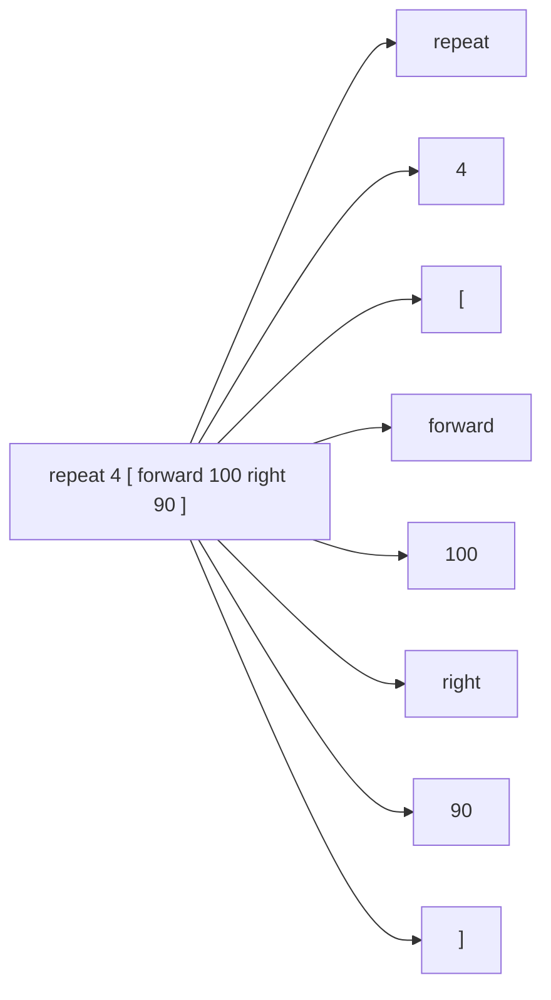

# 02 · Tokens

A **token** is one "word" of code. When you read the sentence *"The cat sat,"* your brain doesn't
see a blur of letters — it sees three words. OpenLogo does the same thing with your code: it reads
`forward 100` as two tokens — the word `forward` and the number `100`. Splitting your code into
tokens is the very first thing the computer does before it can understand anything else.

Let's split our whole square example into tokens:

```
repeat 4 [ forward 100 right 90 ]
```



That's **8 tokens** — and this is exactly what OpenLogo's own tokenizer produces for this line
today, each one tagged with what *kind* of token it is:

| Token | Kind |
|---|---|
| `repeat` | keyword — a word built into the language itself |
| `4` | number |
| `[` | bracket — starts a block of instructions |
| `forward` | command name |
| `100` | number |
| `right` | command name |
| `90` | number |
| `]` | bracket — ends the block |

Notice tokens don't care about *meaning* yet — at this stage OpenLogo doesn't know that `forward`
and `100` belong together, only that they're two separate tokens sitting next to each other. That
"who belongs with whom" question is answered by the next machine in the pipeline: the tree-builder
you'll meet on page 04.

## Try it yourself

Pick any line from a turtle program you've written and count its tokens out loud. Every space-
separated word, every number, and every bracket is its own token — even punctuation like `[` and
`]` count as one token each.

**Next up →** page 03, *the lexer* (the machine that actually does this chopping) — coming soon.
