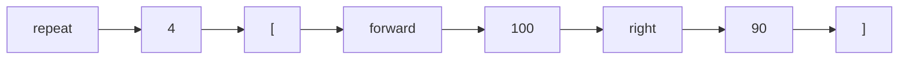

# 02 · Tokens

Before OpenLogo can understand your program, it has to break it into pieces it can actually reason
about. Those pieces are called **tokens** — the smallest meaningful chunks of your code, the way
**words** are the smallest meaningful chunks of a sentence. You don't read a sentence letter by
letter; you read it word by word. OpenLogo doesn't read your program character by character either
— once it's tokenized, it reads it token by token.

Take our series' example:

```
repeat 4 [ forward 100 right 90 ]
```

That single line breaks into exactly **8 tokens**:



Every token also gets a **class** — a label saying *what kind* of piece it is, the way a dictionary
labels a word as a noun or a verb. Here's how OpenLogo classifies each token in our square:

| Token | Class | What that means |
|---|---|---|
| `repeat` | keyword | a reserved structural word built into the language itself |
| `4` | number | a numeral |
| `[` | bracket *(instruction-block)* | opens a bundle of instructions |
| `forward` | primitive | a built-in command name (not reserved — you *could* rename it if you really wanted to, but please don't) |
| `100` | number | a numeral |
| `right` | primitive | another built-in command name |
| `90` | number | a numeral |
| `]` | bracket *(instruction-block)* | closes the bundle |

Notice `repeat` and `forward` get *different* classes even though they're both single words sitting
at the front of an instruction. `repeat` is a **keyword** — it's baked into OpenLogo's grammar and
you can never use it as your own procedure name. `forward` is a **primitive** — a command OpenLogo
ships with, but grammatically just an ordinary name. That distinction — keyword vs. primitive — is
exactly the kind of thing tokens exist to capture.

This is also the same classification your editor uses to paint your code in different colors as you
type (the syntax highlighter). Keywords, numbers, brackets, and command names each get their own
color for the same reason a paint-by-numbers picture uses a different color per number.

## What's real today

✅ **Tokenizing is real and exact** — feed OpenLogo's tokenizer the square example above and you get
back precisely the 8 tokens shown here, in this order, each with its own class.

ℹ️ **There are more classes than we used** — our square only needed a handful. OpenLogo recognizes
15 token classes in total (words/strings, `:variable`s, comments, operators, and a few more for
names of your own procedures and data types), because a real program is built from a lot more kinds
of pieces than one square.

## Try it yourself

Pick any line of turtle code you've written and say it out loud one token at a time, pausing at
every space and every bracket. That pause-per-token rhythm is exactly what tokenizing feels like
from the inside.

**Next up →** [03 · The lexer](03-the-lexer.md)
