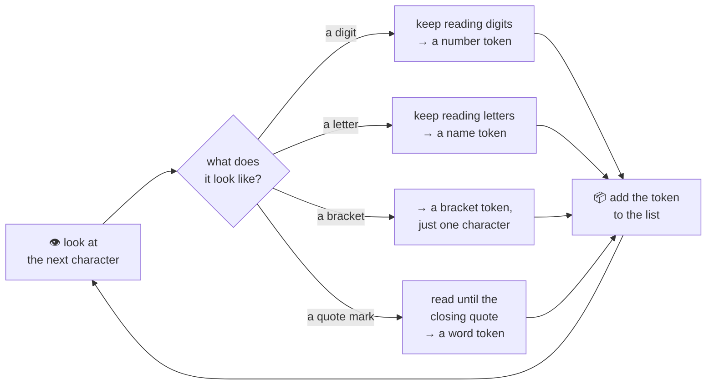

# 03 · The lexer

The **lexer** is the machine that turns your raw text into tokens. Its name comes from "lexical" —
the same root as "lexicon", a word list — because its whole job is spotting where one word-like
piece ends and the next begins.

Here's the trick: the lexer reads your program **one character at a time**, left to right, and
decides on the spot what kind of piece it's looking at, purely from what the next few characters
look like:

Watch it work on our square, `repeat 4 [ forward 100 right 90 ]`:

- `r` is a letter, so the lexer keeps eating letters — `r`, `e`, `p`, `e`, `a`, `t` — until it hits
  a space. That's one **name**-shaped piece: `repeat`.
- The space is skipped (spaces don't become tokens; they just mark where one piece ends).
- `4` is a digit, so the lexer keeps eating digits until they stop. That's one **number**: `4`.
- `[` is a bracket — the lexer doesn't need to look ahead at all, it's a token all by itself.
- ...and so on, all the way to the closing `]`.

This "keep eating while it still looks the same" idea is exactly how *you* already read: once you
see the letter `c`, you don't stop and wonder if the next character is going to turn `cat` into a
number — you just keep reading letters until a space tells you the word is done.

One thing the lexer *doesn't* decide yet: whether a name-shaped piece like `repeat` or `forward` is
a **keyword** or a **primitive**. At this stage they're both just "a name." Telling them apart —
checking `repeat` against OpenLogo's built-in list of reserved words, or noticing `forward` is a
known command — happens a step later, once the pieces are being turned into a tree. The lexer's
only job is finding where the pieces are; deciding exactly what each one *means* comes next.

## What's real today

✅ **Character-by-character scanning is real** — feed OpenLogo's lexer any `.logo` text and it
walks it one character at a time, exactly as described above, and hands back a token for `repeat`,
`4`, `[`, `forward`, `100`, `right`, `90`, and `]`.

✅ **It remembers exactly where every token sits** — line and column — so that if something goes
wrong later, OpenLogo can point at the *exact* spot in your code, not just "somewhere in there."

ℹ️ **It also catches a few raw mistakes on the spot** — an unclosed `"word`, an unclosed `/* comment`,
or a stray character it's never seen before. Those become friendly error messages before your code
even gets a chance to run.

## Try it yourself

Try typing a word with a quote you forgot to close, like `print "hello`. The lexer notices
immediately that the quote never closed — even before anyone tries to run your program.

**Next up →** check the [series map](README.md) for the full list.
