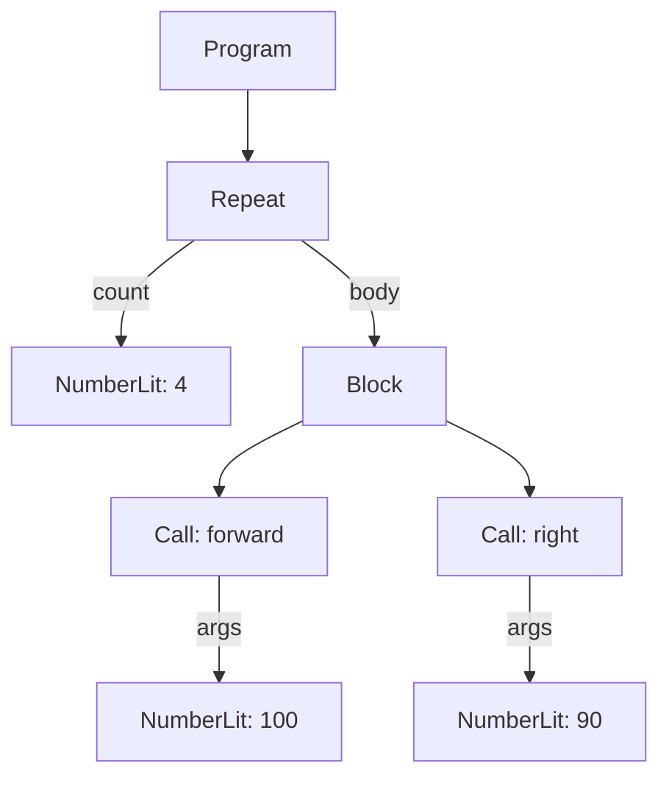

# 04 · The AST

Last time, the lexer chopped your code into a flat list of **tokens**: `repeat`, `4`, `[`,
`forward`, `100`, `right`, `90`, `]`. A flat list is easy to make but hard to *use* — nothing
tells you that `100` belongs to `forward`, or that `forward 100` and `right 90` are both stuck
*inside* the repeat. This page is about the **tree** that fixes that — the next page is about the
machine that builds it.

## The AST: the tree that groups tokens together

The tree is called the **AST** — the **Abstract Syntax Tree**. "Tree" because things nest inside
other things, the same way a table of contents nests chapters inside a book, and sections inside
chapters — each one of those boxes in the tree, like a single chapter or section, is called a
**node**. "Abstract" because it throws away things that don't matter once you've understood the
shape — like exactly which spaces you typed — while keeping everything that does.

Let's build the tree for our square, one token at a time:

```
repeat 4 [ forward 100 right 90 ]
```

- `repeat` tells the parser "this is a repeat instruction — expect a count, then a block."
- `4` becomes that count.
- `[` opens a **block** — a bundle of instructions grouped together, the way a chapter bundles its
  paragraphs. Everything up to the matching `]` belongs inside it.
- `forward 100` becomes one instruction: "call `forward`, with the number `100` as its argument."
- `right 90` becomes another: "call `right`, with the argument `90`."
- `]` closes the block.

The tree that comes out — this is the *real* shape produced by OpenLogo's parser today, not a
simplification:



In the actual data structure, it looks like this (trimmed to the important parts):

```json
{
  "kind": "Repeat",
  "count": { "kind": "NumberLit", "value": 4 },
  "body": {
    "kind": "Block",
    "body": [
      { "kind": "Call", "callee": { "name": "forward" }, "args": [{ "kind": "NumberLit", "value": 100 }] },
      { "kind": "Call", "callee": { "name": "right" }, "args": [{ "kind": "NumberLit", "value": 90 }] }
    ]
  }
}
```

Notice `forward 100` and `right 90` both live *inside* the repeat's `body` — the tree records that
they happen four times, together, before the flat token list ever mattered again. That's the whole
point of building a tree: the grouping is no longer something you have to remember, it's baked into
the shape.

## What's real today

✅ **The parser builds exactly this tree** — running the square example above through OpenLogo's
parser today produces the `Repeat` / `Block` / `Call` shape shown here, node for node. The next
page zooms into exactly how it does that.

✅ **Every node remembers where it came from** — each piece of the tree also carries a source span
(which characters of your original text it came from), so later machines — like the checker or the
interpreter — can point at the exact spot in your code when something goes wrong.

ℹ️ **The tree has more node kinds than we showed here** — `Repeat` and `Call` are just two of them.
OpenLogo also has tree shapes for `if`, `while`, `for`, `define … end`, and more — each one mirrors
one rule in the grammar.

## Try it yourself

Take any short turtle program you've written and, on paper, draw a box for each instruction and an
arrow from each block to the instructions inside it — that's you building an AST by hand, the same
way OpenLogo's parser does it automatically.

**Next up →** [05 · The parser](05-the-parser.md)
