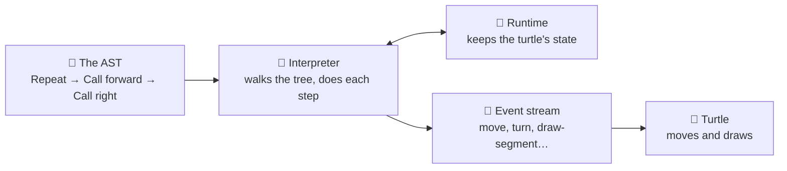

# 05 · The interpreter & runtime

You already met these two in the big picture, but let's zoom all the way in. Once the reader has
built the tree (the **AST**) for our square:

```
repeat 4 [ forward 100 right 90 ]
```

...nothing has actually *happened* yet. The tree is just a plan. Turning that plan into a moving,
drawing turtle is the job of two more machines working together:



- **The interpreter** walks the tree branch by branch, and for each part it actually *does* what
  that part says. Think of it like a cook following a recipe: it reads one step (`forward 100`),
  does exactly that step, then moves to the next — never skipping ahead, never guessing.
- **The runtime** is the engine underneath that keeps track of everything while the interpreter
  works — where the turtle is standing, which way it's facing, whether the pen is down. It's like
  the kitchen itself: the counters, the pans, the state of everything the cook is using. The cook
  (interpreter) reads the recipe; the kitchen (runtime) is what the cook works *in* and works
  *with*.

## How the turtle finds out what to draw

Every time the interpreter does a step that matters — moving, turning, changing the pen — the
runtime writes down exactly what happened as one **event**, in order — like a flight recorder or
an old cassette tape, capturing each moment so it can be played back later. This ordered list is
called the **event stream** (or trace), and it's the *only* way the turtle knows what to draw. The
turtle never looks at your code directly — it just plays back the event stream, one event at a
time.

Run our square today and here's the real event stream OpenLogo produces (trimmed to the first
lap around the loop):

```
0  instruction   { statement_kind: "Repeat" }
1  instruction   { statement_kind: "Call" }          // forward 100
2  move          { from: [0, 0], to: [0, 100], heading: 0 }
3  draw-segment  { from: [0, 0], to: [0, 100], color: "black", width: 1 }
4  instruction   { statement_kind: "Call" }          // right 90
5  turn          { from: 0, to: 90 }
```

Notice the pattern: `forward 100` alone produces *two* events, not one — a `move` event (the
turtle's position changed) and a separate `draw-segment` event (a line got drawn), because the
pen could be up, in which case only `move` would fire and nothing would be drawn. Then `right 90`
produces one `turn` event. The interpreter repeats this exact five-step dance (`instruction` →
`move` → `draw-segment` → `instruction` → `turn`) four times for `repeat 4 [ … ]`, tracing a real
square.

## What's real today

✅ **The turtle really moves, today** — running the square above against the current runtime
produces exactly the events shown, four times over: `move`/`draw-segment` pairs for every
`forward`, `turn` events for every `right`, ending back where it started, facing the way it began.

✅ **The event stream is deterministic** — run the same program twice and you get the exact same
events in the exact same order, every time. That's what lets the turtle renderer, tests, and
future tools all agree on what "happened."

ℹ️ **The runtime also tracks more than position** — pen color, pen width, whether the turtle is
visible, and more all live in the same runtime state, and each change gets its own event kind
(`pen-change`, `color-change`, `visibility-change`, and others) the same way moving and turning do.

## Try it yourself

Change `right 90` to `right 45` in the square and picture the event stream before you run it: the
`move`/`draw-segment` events stay the same shape, but every `turn` event now goes `{ from: X, to:
X + 45 }` instead of `+ 90` — and it takes 8 turns, not 4, to face the original direction again.

**Next up →** [06 · How the turtle draws](06-how-the-turtle-draws.md)
