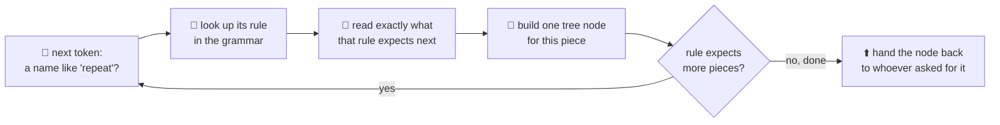
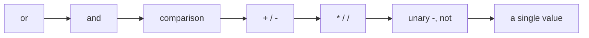

# 05 · The parser

Last time you met the **AST** — the tree that groups your tokens the way they actually belong
together. This page is about the machine that *builds* that tree: the **parser**. Where the lexer
decided *what each piece is* (a number, a name, a bracket), the parser decides *how those pieces fit
together* — the same "what vs. how" split as tokens (page 02, the *what*) and the lexer (page 03,
the *how*).

## Grammar: the rulebook

Before the parser can build anything, it needs a rulebook that says what's even allowed — this is
the **grammar**. Think of it like the rules of a board game: the grammar doesn't play the game for
you, it just says a turn looks like "roll, then move, then optionally buy something." OpenLogo's
grammar says things like "a `repeat` is the word `repeat`, then a count, then a block." It lives in
[`spec/grammar.md`](../../spec/grammar.md), and every shape the parser is allowed to build traces
back to one of its rules.

## How the parser reads your tokens

The parser walks the token list left to right, exactly once, never looking more than a token or two
ahead — a style called **recursive descent**: for each kind of thing it might be reading (a
statement, then an expression, then a *piece* of an expression), it calls a smaller function that
knows how to read just that one shape, and those functions call each other, nesting the way the tree
itself nests.

Watch it work on our square, `repeat 4 [ forward 100 right 90 ]`:

- The parser sees the name `repeat` and looks up its rule: "a `repeat` is the word `repeat`, then a
  count (an expression), then a block."
- It reads the next token, `4`, as that count — a plain number expression, no further pieces needed.
- It sees the `[` and knows this rule's last piece is a **block**: read statements until the
  matching `]`.
- *Inside* the block, it reads `forward 100` as one instruction. Here's the trick that makes this
  work without guessing: the parser already knows `forward` takes exactly **one** argument (that
  arity comes from OpenLogo's own command table, the same one the checker uses), so it reads
  *exactly one* expression — `100` — and stops. It never wonders whether `right` might also belong
  to `forward`'s argument list.
- It reads `right 90` the same way — one argument, by the same rule.
- It sees the `]`, closes the block, and hands the finished `repeat` node back up.

That "read exactly as many pieces as the rule says, no more, no less" idea is exactly why
`forward 100 right 90` never gets misread as one giant instruction — the parser isn't scanning for
where an instruction *looks* like it ends, it's counting down arguments it already knows it needs.

## Expressions have their own rulebook: precedence

Plain calls like `forward 100` are the easy case. Expressions with operators need one more rule:
**precedence** — which operator "grabs" its operands first. `2 + 3 * 4` should be 14, not 20,
because multiplication grabs tighter than addition. The parser encodes this as a ladder of rules,
each one calling the next-tighter one first:

Reading `2 + 3 * 4`, the `+`-level rule first asks the `*`-level rule for its left side, gets `2`
straight back (no `*` there), then asks the `*`-level rule for its right side — which itself reads
`3 * 4` as one tightly-bound piece before the `+` ever combines it with the `2`. The ladder is what
guarantees multiplication happens first, purely from which rule calls which.

## What's real today

✅ **The parser is real, hand-written recursive descent** — `@openlogo/parser`'s `parse()` function
walks the token stream from the lexer using exactly this "each rule calls the next rule" structure,
producing the AST shown on the last page for our square, node for node.

✅ **Arity-driven argument reading is real** — `forward` reads exactly one argument, `set` reads a
place and a value, because the parser looks up each command's argument count from OpenLogo's shared
command table before it starts reading — the same table the checker uses to recognize a command
exists at all.

ℹ️ **Bad input never crashes the parser** — a missing `]` or an incomplete `repeat` doesn't throw
and give up; the parser collects a diagnostic (page 09's error codes) and keeps going with a
best-effort tree, so you can still see highlighting and other findings even in broken code.

## Try it yourself

Read `right 90 forward 100` out loud, one rule at a time: "`right` needs one number — that's `90`,
done. Next instruction: `forward` needs one number — that's `100`, done." That step-by-step,
one-rule-at-a-time reading is exactly how the parser works through it.

**Next up →** [06 · The interpreter & runtime](06-the-interpreter-and-runtime.md)
