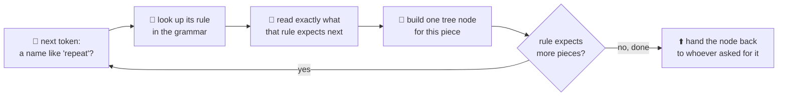
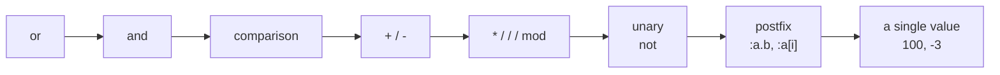

# 05 · The parser

Last time you met the **AST** — the tree that groups your tokens the way they actually belong
together. This page is about the machine that *builds* that tree: the **parser**. Where the lexer
decided *what each piece is* (a number, a name, a bracket), the parser decides *how those pieces fit
together* — the same "what vs. how" split as tokens (page 02, the *what*) and the lexer (page 03,
the *how*).

## Grammar: the rulebook

Before the parser can build anything, it needs a rulebook that says what's even allowed — this is
the **grammar**. Think of it like the rules of a board game: it doesn't play the game for you, it
just says a turn looks like "roll, then move, then optionally buy something." OpenLogo's grammar
says things like "a `repeat` is the word `repeat`, then a count, then a block." It lives in
[`spec/grammar.md`](../../spec/grammar.md), and every shape the parser builds traces back to one of
its rules.

## How the parser reads your tokens

The parser mostly walks the token list left to right, a style called **recursive descent**: for each
kind of thing it might be reading (a statement, then an expression, then a *piece* of an expression),
it calls a smaller function that knows how to read just that one shape, and those functions call
each other, nesting the way the tree itself nests. Before any of that starts, it does take one quick
peek through the *whole* token list — just to note how many inputs each of your own `define`d
procedures expects, so it can read a call to one of them correctly later.


```mermaid
flowchart LR
  A["👀 next token:<br/>a name like 'repeat'?"] --> B["📖 look up its rule<br/>in the grammar"]
  B --> C["🧩 read exactly what<br/>that rule expects next"]
  C --> D["🌳 build one tree node<br/>for this piece"]
  D --> E{"rule expects<br/>more pieces?"}
  E -->|"yes"| A
  E -->|"no, done"| F["⬆️ hand the node back<br/>to whoever asked for it"]
```

Watch it work on our square, `repeat 4 [ forward 100 right 90 ]`:

- `repeat` is a **keyword** — like `if`, `while`, and `set`, it gets its own dedicated rule,
  hand-written to match its exact shape: "the word `repeat`, then a count, then a block."
- `4` is read as that count — a plain number, no further pieces needed.
- `[` opens the **block**: read statements until the matching `]`.
- *Inside*, `forward` is different — it's a **primitive**, not a keyword, so it follows one shared
  rule: "read exactly as many arguments as this primitive's known arity says." The parser already
  knows `forward` takes exactly **one** argument (that arity comes from OpenLogo's own command
  table, the same one the checker uses), so it reads *only* `100` and stops — it never wonders
  whether `right` belongs to `forward`'s argument list.
- `right 90` reads the same way, then `]` closes the block and the finished `repeat` node hands back
  up.

That "read exactly as many pieces as the rule says" idea is exactly why `forward 100 right 90` never
gets misread as one giant instruction — the parser isn't scanning for where an instruction *looks*
like it ends, it's counting down arguments it already knows it needs.

## Expressions have their own rulebook: precedence

Plain calls like `forward 100` are the easy case. Expressions with operators need one more rule:
**precedence** — which operator "grabs" its operands first, so `2 + 3 * 4` comes out 14, not 20. The
parser encodes this as a ladder, each rule calling the next-tighter one first:


```mermaid
flowchart LR
  A["or"] --> B["and"] --> C["comparison"] --> D["+ / -"] --> E["* / / / mod"] --> F["unary<br/>not"] --> G["postfix<br/>:a.b, :a[i]"] --> H["a single value<br/>100, -3"]
```

Reading `2 + 3 * 4`: the `+`-level rule asks the `*`-level rule for its left side, gets `2` straight
back, then asks it for the right side — which reads `3 * 4` as one tightly-bound piece *before* the
`+` combines it with the `2`. The ladder guarantees multiplication happens first, purely from which
rule calls which.

## What about newlines?

Everything above happened on a single line. But what if your program is longer than one line — does
the parser just ignore the Enter key, the way it ignores extra spaces?

Not quite. **A newline normally ends a statement.** So if you write:

```logo
print 1 + 2
```

that's one statement. But split it across two lines and put the `+` at the end of the first:

```logo
print 1 +
  2
```

It's *still* one statement — and it still prints `3`. The parser sees the trailing `+` at the end
of line one and knows that operator needs something on its right side, so it keeps reading into the
next line. The `+` holds the door open.

The same works the other way around — put the operator at the *start* of the second line:

```logo
print 1
  + 2
```

Still one statement, still `3`. The parser sees `+ 2` at the start of a new line, recognizes `+` as
an operator that needs a left side, and reaches back to `1` on the previous line.

Both placements work because an operator is a **continuation trigger** — a token that syntactically
*demands* more input. An unclosed delimiter `(`, `[`, or `{` works similarly: newlines inside it
don't close the enclosing construct, no matter how many lines it spans. The complete rule lives in
[`spec/grammar.md`](../../spec/grammar.md), and
[LDR-0008](../design-notes/0008-statement-delimitation-and-continuation.md) explains *why* the
language was designed this way.

### The trap: arity alone doesn't continue

Here's the assumption that catches people. `print` needs one argument — so if you write `print` on
one line and `abs 3` on the next, surely `print` just grabs `abs 3` as its input?

It doesn't. The parser sees `print` at the end of a line, and `print` is a *command name*, not an
operator — it isn't a token that syntactically demands more. So the newline ends the statement.
You get two separate statements: a bare `print` (which errors because it got zero inputs instead
of one) and a standalone `abs 3` that the runtime never reaches.

```text
print       ← statement 1: no argument → ol-not-enough-inputs
abs 3       ← statement 2: parsed separately, but execution already stopped
```

A less dramatic version of the same split — where both statements *do* run — is this:

```logo
print 10
abs 3
```

`print 10` prints `10` and completes normally; `abs 3` computes `3` on its own, but nothing uses
the result.

Either way, the dividing line is the same: an operator is a continuation trigger; a command that
happens to want more arguments is not. The rule is driven by the *tokens at the line boundary*,
not by how many arguments a command still needs.

## What's real today

✅ **The parser is real, hand-written recursive descent** — `@openlogo/parser`'s `parse()` walks the
lexer's token stream using exactly this "each rule calls the next rule" structure, producing the
AST from the last page for our square, node for node.

✅ **Arity-driven argument reading is real** — `forward` reads exactly one argument from OpenLogo's
shared command table, the same one the checker uses. Keywords like `set` and `repeat` skip that
table entirely — each has its own hand-written rule for its exact shape.

✅ **Newline-as-statement-terminator is real** — the continuation triggers described above (trailing
operator, leading operator, unclosed bracket) are the shipped behaviour in `@openlogo/parser`, and
the arity-doesn't-continue rule is what makes a bare `print` on its own line report
`ol-not-enough-inputs` instead of silently grabbing the next line.

ℹ️ **Bad input never crashes the parser** — a missing `]` or an incomplete `repeat` doesn't throw and
give up; the parser collects a diagnostic (page 09's error codes) and keeps going with a best-effort
tree, so you still see highlighting and other findings even in broken code.

## Try it yourself

Read `right 90 forward 100` out loud, one rule at a time: "`right` needs one number — that's `90`,
done. Next instruction: `forward` needs one number — that's `100`, done." That step-by-step reading
is exactly how the parser works through it.

**Next up →** [06 · The interpreter & runtime](06-the-interpreter-and-runtime.md)
