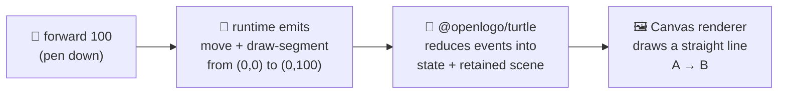

# 06 · How the turtle draws

You typed `forward 100`. A line showed up on your screen. How? Think of an Etch-A-Sketch: you turn
the knobs, and somewhere inside, a stylus drags a line across the screen exactly as far and in
exactly the direction you turned. OpenLogo's turtle works the same way — except the "knobs" are
your commands, and the last page already showed you the recorder that writes down every knob-turn:
the **event stream**.

This page zooms into the last mile: how that event stream becomes an actual line on the canvas.

## From one event to one line



The runtime never draws anything itself — it only ever writes events. Two separate reducers inside
`@openlogo/turtle` fold that same event stream into two things a renderer needs: **turtle state**
(where the turtle is standing, which way it's facing, is the pen down) and the **retained scene**
(every segment, fill, and stamp drawn so far, in order). The Canvas renderer then paints the scene:
one `draw-segment` event, one straight line, from its `from` point to its `to` point — nothing
fancier than that.

## Pen down vs. pen up

Here's the part that makes it click: `forward 100` with the pen down fires *two* events — `move`
(the turtle's position changed) and `draw-segment` (a line got drawn). But `pen_up` followed by
`forward 100` only fires `move` — no `draw-segment` at all. Same distance, same direction, but
nothing lands on the canvas, exactly like lifting the pen off a piece of paper before sliding your
hand across it.

Run this on the shipped runtime and see it for yourself:

```
forward 50
pen_up
forward 50
pen_down
forward 50
```

The real event stream this produces is:

```
0  instruction   { statement_kind: "Call" }          // forward 50
1  move          { from: [0, 0], to: [0, 50] }
2  draw-segment  { from: [0, 0], to: [0, 50] }
3  instruction   { statement_kind: "Call" }          // pen_up
4  pen-change    { from: "down", to: "up" }
5  instruction   { statement_kind: "Call" }          // forward 50
6  move          { from: [0, 50], to: [0, 100] }
7  instruction   { statement_kind: "Call" }          // pen_down
8  pen-change    { from: "up", to: "down" }
9  instruction   { statement_kind: "Call" }          // forward 50
10 move          { from: [0, 100], to: [0, 150] }
11 draw-segment  { from: [0, 100], to: [0, 150] }
```

Notice event 6: the middle `forward 50` moves the turtle just like the other two, but with no
matching `draw-segment` — so the canvas ends up with two separate line segments and a gap between
them, even though the turtle glided smoothly through all three moves.

## What's real today

✅ **One `draw-segment` event, one straight line** — the Canvas renderer paints each segment
exactly as recorded: a straight line from its `from` point to its `to` point, in the color and
width captured on that segment.

✅ **Pen state really controls drawing, not just movement** — running the pen-up example above
against the current runtime produces exactly the events shown: a gap in the drawing wherever the
pen was up, with the turtle's position still tracked underneath.

ℹ️ **State and scene are two separate reducers** — `@openlogo/turtle` folds the same event stream
twice: once into turtle *state* (position, heading, pen, color, …) and once into the retained
*scene* (the segments, fills, and stamps a renderer repaints from). Neither reducer needs to know
about the other's job. See [`spec/rendering.md`](../../spec/rendering.md) for the full normative
drawing model.

## Try it yourself

Draw our square from earlier pages, but lift the pen for one side:

```
repeat 4 [
  forward 100
  pen_up
  right 90
  pen_down
]
```

Wait — that only lifts the pen while turning, and turning never draws a segment anyway. Try moving
the `pen_up`/`pen_down` so only one *side* of the square is skipped, and predict how many
`draw-segment` events you'll see before you run it (hint: it's not four anymore).

**Next up →** [07 · Highlighting](07-highlighting.md)
