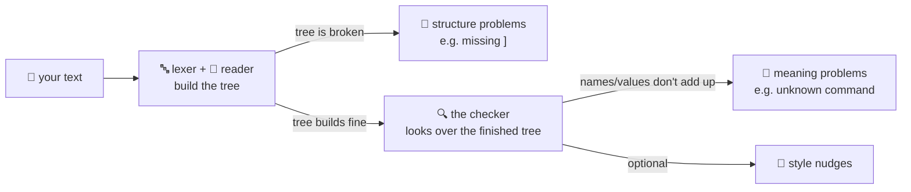

# 07 · The checker

Writing code, you *will* make mistakes — everyone does, always. The question is how fast you find
out, and how much help you get once you do. That's the checker's whole job: it reads your code
without running it and tells you not just *that* something's wrong, but *what* and *how to fix it*
— like a spelling-and-grammar checker for code, one that also suggests the correction instead of
just underlining the mistake in red.

OpenLogo actually looks for problems in a couple of different moments, and it's worth telling them
apart:



**Structure problems** are caught the moment your text is turned into a tree — before there's even
a tree to check. Forget a closing `]`, or leave a `define` without an `end`, and you'll never get
that far:

```
define add_one :n
  return :n + 1
```

Try to read that, and OpenLogo tells you:

> `define needs a body. wrap the body in [ ] or close it with end.`

**Meaning problems** are different: your text *does* build into a valid tree, but something in it
doesn't add up once OpenLogo looks at the whole picture — you called a command that doesn't exist,
or read a variable you never set. This is where **the checker** — the same optional helper
introduced back on page 01 — steps in. Type this:

```
prnt 5
```

The tree builds just fine (`prnt` looks exactly like a valid command name). But the checker knows
every command OpenLogo actually has, and `prnt` isn't one of them — so it tells you:

> `i don't know how to prnt. did you mean print?`

That "did you mean" isn't magic — the checker measures how many single-letter edits (add, remove,
or swap one letter) separate your typo from a real command name. `prnt` → `print` is two edits
away, so it counts as "close enough" and gets suggested. A wildly different word wouldn't.

One honest detail: by default, the checker only knows the **Core** words — `print`, `repeat`,
`define`, and friends. Turtle words like `forward` and `right` are a separate vocabulary that the
checker only checks against once you tell it the turtle is in play (the same "tell the
spell-checker you're writing in French" idea from page 01) — so a plain `fowad 100` today just says
"I don't know how to fowad," while switching on the turtle vocabulary turns that into "did you mean
forward?"

Finally, a small set of **style nudges** — gentle warnings, not errors, like suggesting your own
procedure names use `snake_case` — are entirely optional. They only show up if you explicitly ask
the checker to include them.

Remember: the checker is a **helper you can ask for, not a gate you must pass**. Your program can
run without ever asking the checker anything first — running and checking are two separate,
independent ways of looking at the very same tree.

## What's real today

✅ **Structure problems are caught immediately** — an unclosed `[` or a `define` missing its `end`
is reported the moment OpenLogo tries to build your tree, with a plain-language message.

✅ **"Did you mean...?" really works** — a Core-word typo like `prnt` for `print` gets suggested
today, out of the box.

ℹ️ **Turtle-word suggestions need the turtle vocabulary switched on** — by default the checker only
knows Core words; `forward`/`right` typos only get suggested once the turtle vocabulary is active.

## Try it yourself

Deliberately misspell a command you use often — try `prnt "hi"` instead of `print "hi"` — and see
the checker's suggestion for yourself.

**Next up →** check the [series map](README.md) for the full list.
