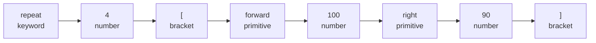

# 08 · Highlighting

Open your `.logo` file in an editor and every piece of it lights up in a different color: keywords
in one shade, numbers in another, commands in a third. That's **syntax highlighting** — and it's
the same idea as using different highlighter pens on your notes: one color for dates, one for
names, one for definitions, so your eyes can spot what's what before you even read the words.

OpenLogo does this by reusing the exact same tools that already understand your code — the
**lexer** and the **parser** (the tree-builder from earlier pages) — instead of guessing from
patterns. That matters: a pattern-guesser might get confused and color a variable named `printer`
as if it were the command `print`. OpenLogo never does, because it isn't guessing — it's asking the
lexer and the tree what each piece of your code actually *is*.

Run OpenLogo's real highlighter on our square, `repeat 4 [ forward 100 right 90 ]`, and here's
exactly what comes back:

Two things worth noticing:

- `repeat` gets the **keyword** color and `forward`/`right` get the **primitive** color — the same
  keyword-vs-primitive split from the tokens page, now painted as actual colors instead of just
  labels.
- The `[` and `]` aren't just "a bracket" — the highlighter also knows their **role**. Here it's
  `instruction-block`, because this particular pair wraps a bundle of instructions to repeat. A
  different pair of brackets, wrapping a plain list of numbers like `[ 1 2 3 ]`, would get the role
  `list` instead. The highlighter figures out the role by looking at the *shape* of the tree around
  the brackets, not just the bracket character itself — that's only possible because it's reusing
  the parser's tree, not scanning text.

OpenLogo recognizes **15 token classes** in total — our square only uses four of them (`keyword`,
`number`, `primitive`, and `bracket`) — and that bracket pair also carries a **role**,
`instruction-block`, on top of its class. Think of a role like an actor playing a different part in
each movie: the same `[ ]` characters play "the hero" (an instruction block) in one program and "the
villain" — er, "an ordinary list" — in another, depending on the tree around them. Bigger programs
light up more classes: your own procedure names get their own color once you `define` them, and
`:variable`s, words, and comments each get one too.

## What's real today

✅ **Highlighting is grammar-derived, not guesswork** — it reuses the real lexer and the real tree
(the parser's output), so it never mis-colors a variable that happens to share a name with a
command.

✅ **Bracket roles are real** — the `[ ]` around our square's repeat block is correctly classified
`instruction-block`, distinct from an ordinary list.

ℹ️ **A few classes need the tree, not just tokens** — most classes (keyword, number, primitive,
bracket, and more) can be decided token-by-token. A handful, like the name of a procedure you
`define` yourself, need the tree too, so OpenLogo can tell "this is the name being *defined*" apart
from "this is the name being *called*."

## Try it yourself

Open any `.logo` file in an editor with OpenLogo highlighting and look closely: `define`, `if`, and
`repeat` should all share one color (keywords), while `forward`, `print`, and `right` share another
(primitives) — even though, to your eyes, they're all "just words."

**Next up →** [09 · The checker](09-the-checker.md)
