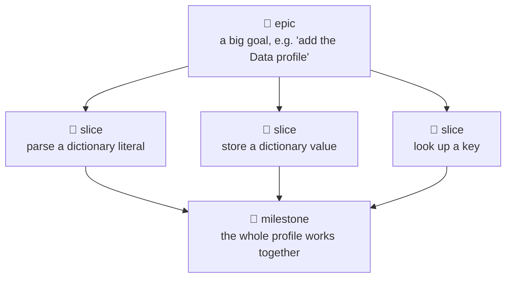
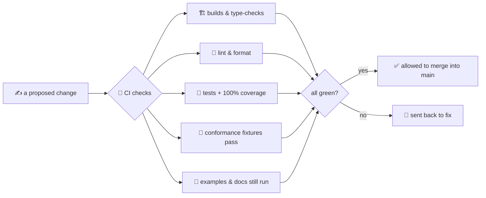

# 09 · How we built it

The other pages in this series show you the *machines* inside OpenLogo — the lexer, the tree, the
interpreter, the turtle. This page is about the *team* that built them, and the habits that keep
everyone's work from breaking everyone else's.

## Epics, slices, and milestones

Think of it like building a treehouse with friends. An **epic** is the big goal — "build a
treehouse" — too large to do in one afternoon. You break it into **slices**: one slice might be "put
up the floor," another "build the ladder." Each slice is small enough to finish and test the same
day. A **milestone** is when you step back and check that a *whole area* works together — the floor
holds weight, the ladder reaches it — not just that each board is nailed on.

OpenLogo works the same way. An epic might be "add the Data profile" (dictionaries, records). A
slice is one thin piece of that, like "parse a dictionary literal." A milestone is a roadmap
checkpoint — like **M2**, "Turtle & Rendering" — where a whole group of features is proven to work
together, not just built.

## One vertical slice, start to finish

It's tempting to build *all* the parsing first, then *all* the running, then *all* the drawing. We
don't. Every slice is a **vertical slice** — one feature built all the way down, through every layer,
before moving to the next. It's like baking one whole cupcake — batter, baking, frosting, sprinkles —
instead of mixing a huge tray of batter with nothing ready to eat yet.

A slice for a new turtle command travels through: the **grammar** (how do you spell it?) → the
**tree** (the AST, from page 04) → the **interpreter** (page 05, actually running it) → the **turtle**
(actually moving) → **tests** that prove it → **docs** that explain it. Only once all of that is
done is the slice finished — a half-built layer doesn't count.

## A team of specialist agents

OpenLogo isn't written by one person doing everything. It's built by twelve specialized AI agents,
each an expert in one part, like a small software studio: a **product-owner** (decides what's next),
a **language-designer** (the grammar), an **interpreter** engineer (the lexer, tree, and running
engine), a **turtle-engine** (moving and drawing), **learner-experience** (the app you type into), a
**geometry-teacher**, **curriculum**, and **ai-tutor** (teaching), **testing** (proving it works),
**documentation** (these pages), **devops** (the automatic checks), and an **orchestrator** who
coordinates everyone. Each owns one clear area, like separate artists and engineers on a team.

## The safety net: keeping `main` always working

**`main`** is the one shared, official copy of OpenLogo everyone builds on — like the master copy
of a shared document. Nobody wants a broken master copy, so nothing reaches it without passing
through **CI** ("continuous integration") — a robot that automatically checks every proposed change
the instant it's proposed, before anyone else even sees it.

That robot enforces our **Definition of Done** — the checklist a change must pass before it's allowed
to merge into `main`:

One check deserves its own explanation: a **conformance fixture** is a tiny recorded example — "if
you run *this* OpenLogo program, you must see *exactly* these events happen" — like an answer key a
teacher checks your work against. Every new feature needs one, so we can prove it behaves correctly
forever, not just today.

## What's real today

✅ **The team and workflow are real and active** — the twelve agents, the vertical-slice habit, and
epics/slices/milestones are exactly how every page in this series (including this one) got built.

✅ **CI enforces the Definition of Done on every change** — building, type-checking, linting, tests,
100% coverage, and conformance fixtures all have to pass before anything reaches `main`.

ℹ️ **Milestones keep growing** — OpenLogo reached its first fully-working milestone (Core Language +
Turtle & Rendering) already; later milestones add more profiles like Data, Geometry, and the AI
tutor, one vertical slice at a time.

## Try it yourself

Open the `.github/agents/` folder in the OpenLogo repository and count how many specialist agents
you find — see if you can match each one to the part of the language it owns, using the list above
as a guide.

**Next up →** [10 · Where you type it](10-where-you-type-it.md)
