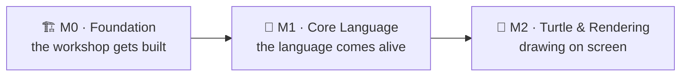

# 09 · What we shipped

Every other page in this series shows you one *machine* — the lexer, the tree, the interpreter, the
checker. This page zooms out: forget how it works — **what does OpenLogo have, right now, that you
could run?** Think school report card: not "how did you study," but "what you learned."

## Milestones so far

OpenLogo's roadmap is cut into **milestones** — checkpoints where a whole group of features is
proven to work *together*. Here's where we stand:

M0, M1, and M2 are all real, merged into shared code — Core Language and Turtle & Rendering shipped
together as
[the tagged `v0.1.0` release](https://github.com/pmalarme/open-logo/releases/tag/v0.1.0), and the
turtle really draws.

## M0 · Foundation — building the workshop

Before building a language, you need a workshop. M0 built one:

- **The monorepo** — every OpenLogo package (lexer, tree-builder, interpreter, turtle, the app you
  type into) lives in one shared project, like every tool in a woodshop on the same shelves. It's
  built with a **toolchain** — the tools (TypeScript 7) turning source code into a runnable program,
  like lumber into finished boards.
- **CI** ("continuous integration") — a robot checking every proposed change instantly, enforcing our
  **Definition of Done**: building, type-checking, style, and tests must pass before a change joins
  shared code, like an inspector who won't let an unchecked part onto the line.
- **The conformance harness** — runs **conformance fixtures**: tiny examples saying "run *this*
  program, see *exactly* these results" — an answer key checked automatically, instead of once by a
  teacher.
- **Four shared contracts** — a **contract** is a shape everyone agrees to use, like every outlet in
  a country sharing one plug shape. OpenLogo has four:
  - the **AST** — the tree shape a parsed program takes (page 04)
  - the **event stream** — a play-by-play of what happened while your program ran, like a
    sportscaster's call
  - the **`ol-*` diagnostics** — every error/warning, with its own stable code, like a doctor's
    diagnosis codes
  - the **token classes** — categories a highlighter sorts words into (page 06)

  Agreeing on these first let separate teams build the lexer, turtle engine, and highlighter **at
  the same time** without colliding — like crews agreeing on measurements before framing walls.

## M1 · Core Language — the language wakes up

M1 turned the empty workshop into a language you can run — text in, real behavior out, before a
single turtle command existed (turtle graphics are their own milestone, M2 — more below). It was
built as a **walking skeleton**: the smallest version of every layer, wired end to end, before any
layer got fancy — like sketching a stick figure before adding muscle and skin.

- **Reading and running your code** — the lexer, reader, AST (pages 03–04), interpreter, and runtime
  (page 05) cover the whole Core grammar, including `define … end` procedures: teach OpenLogo a
  recipe once (`define square :size … end`) and call it by name again.
- **Deciding and repeating** — the **control forms** `if`/`while`/`repeat`/`forever`/`for` (deciding
  *whether* or *how many times* other instructions run), plus **comprehensions** — `map`, `filter`,
  `reduce` — transforming a whole list in one line: `map x in [ 1 2 3 ] [ :x * 2 ]` doubles every
  number without writing the loop yourself.
- **Words, lists, and math** — Core **reporters** (an instruction handing back an answer instead of
  doing something):
  - text and lists: `word`/`sentence`/`first`/`last`/`butfirst`/`butlast`/`fput`/`lput`/`count`/
    `uppercase`/`lowercase`
  - math: `abs`/`sqrt`/`round`/`power`/`random`
  - **predicates** — yes/no tests like `empty?`/`member?`
  - `print`/`show` let your program talk back
- **Errors, colors, and a place to try it** — `ol-*` diagnostics became real error messages, the
  checker (page 07) learned every Core word (`prnt` suggests `print`), the highlighter (page 06)
  learned every Core token class, and the studio REPL (type a line, see what happens —
  read-evaluate-print-loop) already runs Core: variables, procedures, loops, printing.

Every piece is backed by real conformance fixtures under `tests/conformance/core-language/` —
folders for `procedures/`, `control/`, `comprehensions/`, `lists/`, `variables/`, `diagnostics/`, and
more. This Core-only checkpoint had its own pre-release name, **`0.1.0-core`** — a milestone marker,
not the release you'd install. The actual tagged release came one milestone later, once the turtle
could draw too (see below).

## What's real today

✅ **The full Core language runs, end to end** — lexing, the tree, the interpreter, `define … end`
procedures, every control form, all three comprehensions, and the full Core reporter set, proven by
real fixtures, runnable in the studio REPL.

✅ **The turtle draws too** — `forward`/`right`/pen/color are Turtle & Rendering (M2), not Core, and
they shipped in the same release as Core — the turtle draws today.

✅ **0.1.0 is tagged** — Core Language and Turtle & Rendering shipped **together** as
[the tagged release `v0.1.0`](https://github.com/pmalarme/open-logo/releases/tag/v0.1.0),
OpenLogo's first conformant milestone. `package.json` says `"version": "0.1.0"` for a reason: this
is real, released software, not a work-in-progress checkpoint — and it supersedes the earlier
`0.1.0-core` pre-release name above.

## Try it yourself

Open `tests/conformance/core-language/` in the OpenLogo repo and count the folders — each is a
different piece of Core. Open a `.logo` file next to its `.expected.json` match to see a real proof.

**Next up →** You've finished the series! Head back to the [series map](README.md) to revisit any page.
