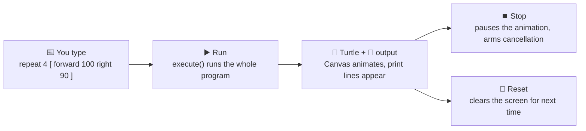

# 11 · Where you type it — the studio REPL and Run/Stop/Reset

Every other page in this series shows you a *machine* — the lexer, the tree, the interpreter, the
turtle. This page shows you the *room* you actually sit in: the **studio**, the app where you type
OpenLogo and watch it happen. Think of a calculator: you type an expression, press equals, and see
the answer right there — then you keep typing more. The studio works the same way, except instead
of just numbers, you get a moving, drawing turtle.

## Type it, run it, see it



That loop — **type, run, see what happened, go again** — has a name: a **REPL**
("read‑evaluate‑print loop"). The studio's REPL isn't a separate, simplified engine; it calls the
exact same `execute()` function from page 06's interpreter and runtime. Nothing about *how* your
code runs changes because you typed it into the studio instead of running it any other way — the
studio just gives you buttons for the loop.

## Run, Stop, Reset — and the safety net underneath

The studio tracks one status for your program at all times: **Ready** (nothing has run yet),
**Running**, **Complete** (it finished on its own), or **Stopped** (you or the safety net cut it
off). Three buttons drive that status:

- **Run** calls `execute()` on whatever you typed, then plays the turtle's moves on the Canvas and
  prints any `print` lines, in order.
- **Stop** requests cancellation and pauses the turtle animation right where it is.
- **Reset** clears the output and the Canvas and puts the turtle back at the start, ready for a
  fresh **Run**.

Here's a wrinkle worth knowing: `execute()` runs your *whole* program in one go, so **Stop** can't
interrupt a step that's already midway through running — the same way you can't pause a domino run
partway between two dominoes that are still falling. What **Stop** reliably does is pause the
turtle's on-screen animation immediately, and arm cancellation so the *next* thing you run honors
it right away.

So what actually protects you from a program that never finishes on its own? Type
`repeat 10000 [ forward 1 ]` and it runs 10,000 steps and finishes — a lot of steps, but a *finite*
number. Type `forever [ forward 1 ]`, though, and there's no such limit written into the program at
all. That's why every run also carries an **execution budget** — a hard ceiling on how many
instructions a single run may take (1,000,000, by default) — enforced by the runtime itself, not
just the studio UI. Once a program crosses that ceiling, the runtime halts it right there and
reports an `ol-*` diagnostic (page 09's error codes), exactly the same way it would report any
other error:

```logo
forever [ forward 1 ]
```

Running this on the shipped runtime produces exactly one diagnostic and no output — the studio's
diagnostics pane shows it as a single `line:column code (severity): message` line:

```
1:11 ol-limit (error): this program ran 1000000 instructions without finishing, which is the
configured safety limit — check for a loop that never ends, such as an unbounded 'forever' or
'while' whose condition never becomes false.
```

That budget, not **Stop**, is what actually rescues you from a runaway program like this one — and
it lands you in the same **Stopped** status **Stop** does, ready for **Reset**.

## What's real today

✅ **The REPL runs the real engine** — typing code into the studio and pressing **Run** calls the
exact same `execute()` from `@openlogo/runtime` that every other page in this series describes —
there is no separate "studio mode" of the interpreter.

✅ **Run/Stop/Reset are real, working controls** — they drive a genuine `"idle" | "running" |
"done" | "stopped"` status, shown to you as **Ready**/**Running**/**Complete**/**Stopped**.

✅ **The execution budget is real and on by default** — every run is capped at a fixed number of
instructions (1,000,000, unless the host overrides it), so a `forever`/unbounded `while` can't hang
your tab; it halts with `ol-limit`, an ordinary diagnostic like any other.

ℹ️ **Stop can't interrupt mid-step, but it doesn't need to** — a run executes as one atomic call, so
pressing **Stop** mid-run pauses the animation and arms cancellation for whatever you run next,
rather than reaching back into the step already in flight. The instruction budget above is what
actually bounds how long any single call can run.

## Try it yourself

Open the studio, type `repeat 10000 [ forward 1 ]`, and press **Run** — watch it finish on its own
(status turns **Complete**). Then change it to `forever [ forward 1 ]` and press **Run** again:
watch the status turn **Stopped** by itself, with an `ol-limit` diagnostic in the diagnostics pane
— nobody had to press **Stop** for the safety net to catch it.

**Next up →** [12 · What we shipped](12-what-we-shipped.md)
