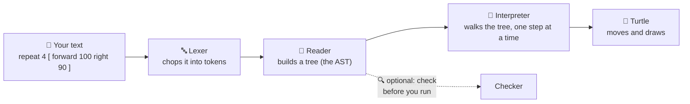

# Learn How It's Built

You've made the turtle draw. Ever wonder what happens *between* you typing `forward 100` and the
turtle actually moving? This series takes you on that journey — no experience needed beyond having
played with turtle commands already.

## The whole trip, in one picture

Every page in this series zooms into one of those boxes and shows you exactly how it works, using
real OpenLogo code and the actual code that runs inside OpenLogo today.

## The map

| Page | What you'll learn |
|---|---|
| [01 · The big picture](01-the-big-picture.md) | The whole journey, zoomed out |
| [02 · Tokens](02-tokens.md) | Chopping your code into little labeled words |
| [03 · The lexer](03-the-lexer.md) | The machine that does the chopping |
| [04 · The AST](04-the-ast.md) | Turning tokens into a tree |
| [05 · The interpreter & runtime](05-the-interpreter-and-runtime.md) | Walking the tree to make things happen |
| [06 · How the turtle draws](06-how-the-turtle-draws.md) | Turning events into pixels on the canvas |
| [07 · Highlighting](07-highlighting.md) | Why keywords turn colors |
| [08 · The checker](08-the-checker.md) | How OpenLogo says "oops," kindly |
| [09 · How we built it](09-how-we-built-it.md) | The human side — how a team builds a language |
| [10 · What we shipped](10-what-we-shipped.md) | What the whole series adds up to, all together |

Read them in order the first time through — each page builds on the last.

## Extra / deeper dives

| Page | What you'll learn |
|---|---|
| [Extra · Why turtle coordinates show decimals](extra-why-coordinates-show-decimals.md) | Why the turtle's position often prints as a long decimal instead of a whole number |

These pages stand on their own — read one any time a specific question comes up, no need to read
the main series first.

## How to read these pages

- Every page fits on roughly one screen.
- Every jargon word gets explained the first time it shows up, with a real-world comparison.
- Every diagram and every code sample is checked against the real OpenLogo code — nothing here is
  made up.
- Try the "Try it yourself" box at the end of each page — it only takes a minute.
