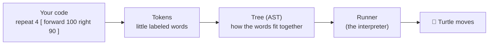

# Learn How It's Built

You've made the turtle draw. Ever wonder what happens *between* you typing `forward 100` and the
turtle actually moving? This series takes you on that journey — no experience needed beyond having
played with turtle commands already.

## The whole trip, in one picture

Every page in this series zooms into one of those boxes and shows you exactly how it works, using
real OpenLogo code and the actual code that runs inside OpenLogo today.

## The map

| Page | What you'll learn |
|---|---|
| [01 · The big picture](01-the-big-picture.md) | The whole journey, zoomed out |
| 02 · Tokens | *(coming soon)* Chopping your code into little labeled words |
| 03 · The lexer | *(coming soon)* The machine that does the chopping |
| 04 · The AST | *(coming soon)* Turning tokens into a tree |
| 05 · The interpreter & runtime | *(coming soon)* Walking the tree to make things happen |
| 06 · Syntax highlighting | *(coming soon)* Why keywords turn colors |
| 07 · When something is wrong | *(coming soon)* How OpenLogo says "oops," kindly |
| 08 · How we built it | *(coming soon)* The human side — how a team builds a language |

Read them in order the first time through — each page builds on the last.

## How to read these pages

- Every page fits on roughly one screen.
- Every jargon word gets explained the first time it shows up, with a real-world comparison.
- Every diagram and every code sample is checked against the real OpenLogo code — nothing here is
  made up.
- Try the "Try it yourself" box at the end of each page — it only takes a minute.
