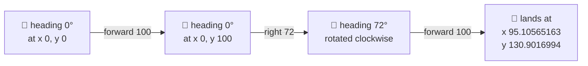

# Extra · Why turtle coordinates show decimals

You ran a program, checked the turtle's position, and saw something like `x 23.2581… y
-7.1465…` instead of a tidy whole number. That can look like a bug. It isn't — this page explains
why, using real OpenLogo code.

## One number, no grid

OpenLogo has exactly **one number type**. Under the hood every number — `4`, `2.5`, `-7.1465` — is
the same kind of value: an **IEEE-754 double**, a standard floating-point number. There's no
separate "whole number" type sitting next to a "decimal number" type. When a value happens to be
whole, OpenLogo prints it without a decimal point (`100`, not `100.0`) — but that's just a nicer
*display*, not a different *type*.

The turtle itself doesn't live on a grid of little squares like a piece of graph paper. Its
position is a pair of ordinary numbers, so it can stand on fractional points, not just the
intersections of grid lines. `(0,0)` is the center of the canvas, `+x` points right, `+y` points
up, heading `0°` points up, and `right` turns clockwise:



## Why a square looks clean but a pentagon doesn't

`forward d` at heading `θ` moves the turtle by `(d·sin θ, d·cos θ)` — straight trigonometry, the
same formula you'd use by hand. Try two sides of a square, turning a right angle in between:

```logo
forward 100
right 90
forward 100
(print "x" xcor)
(print "y" ycor)
```

That prints `x 100` and `y 100` — clean whole numbers. Nothing lucky happened: `90°` is a special
angle where `sin` and `cos` are mathematically `0`, `1`, or `-1`, so the result prints cleanly after
OpenLogo's number formatting (whole values print without a decimal point). Right-angle shapes
(squares, rectangles, staircases) often print that same clean way.

Now try two sides of a pentagon, turning `72°` (a regular pentagon's exterior angle) instead:

```logo
forward 100
right 72
forward 100
(print "x" xcor)
(print "y" ycor)
```

That prints `x 95.10565163` and `y 130.9016994`. Nothing broke — `sin 72°` and `cos 72°` are
genuinely irrational-looking decimals, so the turtle's real position is *supposed* to include them.
A pentagon, hexagon, or any shape whose turn isn't a multiple of `90°` will usually report decimal
coordinates along the way — that's just the same trigonometry at work, not an OpenLogo quirk.

## Landing on whole numbers on purpose

If you want a whole number for something like a label or a comparison, ask for one — OpenLogo
won't invent one for you:

```logo
forward 100
right 72
forward 100
(print "raw y" ycor)
(print "int y" int ycor)
(print "round y" round ycor)
```

That prints `raw y 130.9016994`, `int y 130`, and `round y 131`. `int` **truncates** — it chops off
the fractional part and keeps what's left toward zero. `round` picks the **nearest** whole number
instead, so it can round up where `int` would have rounded down. Neither is "more correct" than the
other; they answer different questions ("what's the whole part?" vs. "what's the closest whole
number?").

A related surprise: `/` is **always real division** — `10 / 4` reports `2.5`, never `2`. OpenLogo
has no separate integer-division operator. If you want the remainder instead of the quotient, ask
for it with `mod`:

```logo
print 10 / 4
print 17 mod 5
```

That prints `2.5`, then `2` (`17` divided by `5` is `3` with `2` left over). The tip to remember:
**wrap a distance or coordinate in `int` or `round` any time you want a whole-number result** —
`int`/`round` report a new number without changing the turtle's stored position; the position only
changes if you feed that new number into a movement or position-setting command yourself. (OpenLogo's
normal number *formatting* already trims a printed value to at most 10 significant digits, but that's
a display detail, not a conversion to a whole number.)

## What's real today

✅ **All of this is exactly how OpenLogo runs today** — every printed value above came straight out
of the runtime; nothing here is illustrative pseudo-output.

ℹ️ **Errors stay friendly, not `NaN`** — dividing by zero or asking for the square root of a
negative number doesn't hand back a broken `NaN`/`Infinity` value that silently poisons the rest of
your program. OpenLogo raises a learner-facing error instead, the same style of message as any
other mistake.

## Try it yourself

Change `right 72` in the pentagon example above to `right 60` (a hexagon's turn) and predict
whether the printed `x`/`y` will be whole numbers or decimals before you run it — then check.
