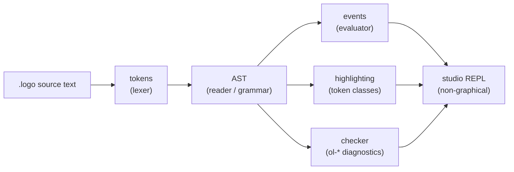

# M0 & M1 retrospective — what we shipped, and how

> Part of the [Learn How It's Built](README.md) series. This one is the grounding doc: it tells the
> real story of the first two milestones, with links straight into the code and tests we actually
> wrote — so every other doc in the series has something concrete to point at.

If you've played with the turtle already — `forward 100`, `repeat 4 [ right 90 ]` — you've been
using a whole *pipeline* someone had to build first: something that reads your text, understands
what you meant, and turns it into actions. This doc is about the first two milestones of building
that pipeline for OpenLogo, before the turtle could even move: **M0 Foundation** and **M1 Core
Language**.

Think of it like building a new school. **M0** is pouring the foundation and laying the pipes and
wiring — nothing visible happens yet, but nothing else is possible without it. **M1** is building
the first classroom and getting it fully working: a place where you can write `print "hello"` and
see `hello` come back, with real error messages when you make a mistake — even though there's no
turtle yet and no drawing. The turtle shows up in M2. This doc is the story of M0 and M1.

## Why start with no turtle at all?

It might seem strange to spend a whole milestone on a *language* with no graphics. But a
programming language has to work correctly on the inside — reading words, doing arithmetic,
remembering variables, running loops — before it's safe to hand it a pen and let it draw. M1 proves
the engine is trustworthy on it own terms first. This is why `docs/delivery.md`'s milestone ladder
puts **Core Language** before **Turtle & Rendering**: Core is the minimal thing that has to be
right, and everything else (drawing, geometry, the AI tutor) builds on top of it.

## M0 Foundation — the workshop before the work

M0 (issues in the closed
[M0 Foundation epic set](https://github.com/pmalarme/open-logo/milestone/1?closed=1)) didn't write
any language features. It built the **workshop**: the tools and shared agreements that let several
people work on different parts of OpenLogo at the same time without constantly bumping into each
other.

### The toolchain

OpenLogo is one monorepo — one repository holding six packages that each do one job (`@openlogo/core`,
`parser`, `runtime`, `turtle`, `studio`, `edu` — see [`docs/architecture.md`](../architecture.md)).
M0 set up:

- **npm workspaces** to manage all six packages together, with one lockfile.
- **TypeScript 7**, in `strict` mode, built with `tsc -b` (project references) so packages only see
  each other's public `dist/*.d.ts`, never each other's internals.
- **Biome** for linting and **Prettier** for formatting, so code style is automatic and consistent.
- **`node:test`** as the test runner, with a **100% line/branch/function coverage gate** — every
  line of shipped code has to be exercised by a test.

You can run all of this yourself from the repo root:

```bash
npm ci               # install exactly what's in the lockfile
npm run build         # tsc -b — compiles every package
npm run typecheck     # tsc -b in check-only mode
npm run lint          # Biome
npm run format:check  # Prettier
npm run test          # node:test
npm run coverage       # node:test + the 100% coverage gate
npm run conformance    # the stack-neutral fixture suite (see below)
npm run examples       # checks every published example still exists and runs
```

`npm ci` just installs; the eight commands after it (`build` through `examples`) are the
**Definition of Done** — the checklist every change has to pass before it's allowed to merge. CI
runs them automatically on every pull request (`.github/workflows/`, owned by `@devops`).

### The conformance harness

A programming language needs to *prove* it behaves correctly, in a way that doesn't depend on which
programming language *implements* it. OpenLogo's answer is the **conformance harness**
(`tests/conformance/`, run by `npm run conformance`): a big folder of paired files —

- a `*.logo` source file (a tiny OpenLogo program), and
- a `*.expected.json` file describing exactly what should happen when you run it (which events fire,
  which diagnostics appear).

These fixtures are **stack-neutral** — they describe *what* OpenLogo does, not *how* our TypeScript
happens to do it — so if OpenLogo were ever reimplemented in another language, the same fixtures
would still prove it correct. By the end of M1 there were fixtures for every Core language feature;
you'll see them linked throughout this doc.

### The four cross-cutting contracts

The trickiest part of building a language with several people at once is making sure everyone's
piece fits together. M0's real deliverable was agreeing on **four shared contracts** — the "seams"
between the packages — *before* anyone built features on top of them. Once these were fixed, the
different teams (parser, runtime, rendering, studio, education) could all build independently and
know their pieces would still fit.

1. **The AST** (Abstract Syntax Tree, `packages/parser/src/ast.ts`) — the tree shape every OpenLogo
   program turns into after parsing. If tokens are like individual Lego bricks, the AST is the
   instruction diagram showing how the bricks click together — "this `repeat` block contains these
   three statements", "this call passes these two arguments." Every kind of instruction, expression,
   and block has its own node shape, and every node remembers exactly where in your source text it
   came from (its **source span**) so error messages can point at the right spot.

2. **The trace/event stream** (`packages/core/src/events.ts`) — a flat, ordered list of "things that
   happened" while a program ran: `print`, `instruction`, `error`, and (once M2 wires up the
   turtle) `move`, and so on — the full registry lives as data in
   [`OL_EVENT_KINDS`](../../packages/core/src/events.ts). It's deterministic (the same program
   always produces the exact same event list) and headless (no drawing, no timing, no frames —
   just facts). That's what lets the turtle renderer, the studio's run loop, and even a future
   `why did my program do that?` explainer all read the *same* trustworthy record of what a
   program did, instead of each reimplementing "what happened." M0 declared the *whole* registry
   up front — every kind any future profile would ever need, turtle motion included — precisely so
   that later milestones only have to add the code that *emits* an event, never invent a new kind.

3. **The `ol-*` diagnostics** (`packages/core/src/diagnostics.ts`) — every error and warning
   OpenLogo can report has one shared shape: a stable code like `ol-unknown-command` or
   `ol-div-zero`, the exact span of source text it's about, a stage (`parse`/`semantic`/`runtime`),
   a severity, and (where useful) a "did you mean …?" suggestion. No part of OpenLogo is allowed to
   throw an ad-hoc string instead — every mistake a learner makes gets one of these structured,
   look-up-able codes, defined normatively in `spec/error-model.md`.

4. **The token classes** (`packages/parser/src/highlight.ts`) — 15 named categories (`keyword`,
   `primitive`, `number`, `:variable`, `comment`, `bracket`, …) that every piece of source text gets
   sorted into, straight from the grammar (not by guessing with regular expressions). This is what
   lets an editor paint `define` one color and a `:variable` another, and it's why the highlighter
   is required to stay in lock-step with the grammar (`packages/parser/src/grammar-version.ts`
   literally refuses to load if the two version numbers disagree).

With those four contracts agreed, M1 could fan out: one thread of work on lexing/parsing, one on
evaluating, one on highlighting, one on the studio REPL — all building against the same shared
shapes, in parallel, without waiting on each other.

## M1 Core Language — the walking skeleton comes alive

M1 (closed epics
[#8 Core Language](https://github.com/pmalarme/open-logo/issues/8),
[#89 Core execution](https://github.com/pmalarme/open-logo/issues/89),
[#108 Core semantic checker](https://github.com/pmalarme/open-logo/issues/108), and
[#122 Core Studio](https://github.com/pmalarme/open-logo/issues/122); 81 closed issues in total)
built the **walking skeleton**: the smallest possible version of "a program goes in, something
correct comes out" — proven end to end before any single piece was made fancy. Once
`print "hello world"` worked all the way from typed text to a printed event, every following slice
just added one more real feature to that same skeleton, one at a time.

Here's the pipeline it built, and where each part of that pipeline actually lives:



### Lexer, reader, grammar, AST

`packages/parser/src/tokens.ts` turns raw characters into tokens (numbers, words, `:variables`,
brackets, operators, comments). `packages/parser/src/parser.ts` reads those tokens against the
grammar in `spec/grammar.md` and builds the AST from `ast.ts`. Along the way it enforces OpenLogo's
own shape of the language: **lowercase keywords**, no commas, no `f(x, y)` call syntax — calls are
just space-separated words, e.g. `print first butfirst [1 2 3]` reads as
`print (first (butfirst [1 2 3]))` because the reader knows `first` and `butfirst` each take
exactly one input (`packages/parser/src/signatures.ts` is the table of every Core primitive's
arity) — it prints `2`.

### The value/type model, the evaluator, and scope

`packages/runtime/src/evaluate.ts` and `execute-internal.ts` walk the AST and actually *run* it.
Core has four value types: `number`, `word` (text, e.g. `"red"`), `list` (`[ ]`), and `boolean`.
Variables are read with `:name` and assigned with `=` or `set … to` (never `make` — that's a
Heritage spelling); `==` compares, `=` assigns. Every evaluation step emits the deterministic events
described above.

```
:x = 5
print :x + 1
```

runs, prints `6`, and — under the hood — emits one `instruction` event per statement (one for the
assignment, one for the `print` call) plus a `print` event carrying the value `6`. (See
`tests/conformance/core-language/variables/` and `tests/conformance/core-language/execution/` for
the fixtures proving this.)

### Procedures — `define … end`

You define your own reusable procedures with `define`, list its parameters as `:name`s, and end it
with `return` (or let it fall off the end with no value):

```
define add3 :a :b :c
  print :a
  return :a + :b + :c
end
print add3 1 2 3
```

prints `1` then `6`. (`to`/`output`/`op` are the classic *Heritage* spellings of the same idea — an
optional alternate profile, not Core.) See
`tests/conformance/core-language/procedures/procedure-multi-params-body.logo` for exactly this
example as a fixture.

### Control forms

`if`/`else`, `while`, `repeat`, `forever`, and `for` all shipped in M1, each with a runtime-safety
net: `repeat`'s count is checked for type then range, `forever` is bounded by a cancellable
instruction budget (so a runaway program can't hang the studio — issue #102), and `for` binds its
loop variable(s) in a fresh scope each pass so nothing leaks out of the loop:

```
for n in [1 2 3]
  print :n
end
```

```
if 2 > 1 [ print "yes" ] else [ print "no" ]
```

```
:n = 0
while :n < 3
  print :n
  :n = :n + 1
end
```

Fixtures: `tests/conformance/core-language/control/` (17+ fixtures covering the long `... end`
form, the short bracketed form, labeled `end for`/`end while`, and destructuring `for [:x :y] in`
binders).

### Comprehensions — `map`/`filter`/`reduce`

No lambda syntax — a comprehension names its own loop variable and a bracketed expression body:

```
:doubled = map n in [1 2 3] [ :n * 2 ]      # → [2 4 6]
:evens   = filter n in [1 2 3 4] [ :n mod 2 == 0 ]   # → [2 4]
:total   = reduce sum n in [1 2 3] from 0 [ :sum + :n ]  # → 6
```

Fixtures: `tests/conformance/core-language/comprehensions/`.

### The Core list & word reporters actually delivered

Every one of these is Core (not an optional profile), actually runs today, and has its own
conformance fixture under `tests/conformance/core-language/execution/`:

| Reporter | What it does |
|---|---|
| `first` | first element of a list/word |
| `last` | last element |
| `butfirst` | everything except the first element |
| `butlast` | everything except the last element |
| `count` | length of a list/word |
| `fput` | put a new element on the front (returns a fresh list) |
| `lput` | put a new element on the back (returns a fresh list) |
| `sentence` | joins lists/words into one flat list |

```
print fput 1 [2 3]      # [1 2 3]
print lput 4 [1 2 3]    # [1 2 3 4]
print count [1 2 3]     # 3
print sentence [1 2] [3 4]   # [1 2 3 4]
```

(`reverse`, `pick`, and `sort` sound similar but are **Data**-profile reporters, not Core — they
land in a later milestone. `word` and `show` are also specified as Core, but the runtime doesn't
evaluate them yet — that gap is tracked separately, not claimed as delivered here.)

Also shipped: arithmetic (`+ - * / mod`, plus `abs sqrt int round power`), comparisons (`==` `<`
`>` `<=` `>=` `!=`, with chaining like `1 < :x < 10`), logic (`and or not`), `is`-predicates
(`empty?`, `member?`, `is_a?`), and `print` output.

### Diagnostics — three layers

M1 delivered all three layers `spec/tooling.md` calls for:

- **Layer 1 (parse)** — `ol-bad-token`, `ol-missing-end`, `ol-mismatched-end`, `ol-unmatched-bracket`
  /`-brace`/`-paren`, `ol-unclosed-string`, `ol-unclosed-comment`.
- **Layer 2 (semantic)** — a static checker (`packages/parser/src/check.ts` and its
  `checker-*.ts` siblings) that catches mistakes *before* you even run the program:
  `ol-unknown-command` (with a "did you mean …?" suggestion), `ol-not-enough-inputs` /
  `ol-too-many-inputs`, `ol-undefined-var`, `ol-reserved-word`, `ol-return-outside-proc`, and more.
- **Layer 3 (style)** — `ol-style-*` lints for things that aren't wrong, just worth nudging (e.g.
  naming conventions).

Fixtures for all of them live in `tests/conformance/core-language/check/` and `diagnostics/`.

### Highlighting

`packages/parser/src/highlight.ts` classifies every token into one of the **15 normative token
classes** (`keyword`, `primitive`, `number`, `word/string`, `:variable`, `comment`, `bracket`,
`brace`, `paren`, `operator`, `index/dot`, `dict-key`, `procedure-name`, `type-name`,
`field-name`) — so an editor can color `define` differently from `:a`, differently from `"red"`.

### The studio REPL runs non-graphical Core

`packages/studio/src` composes all of the above into a headless, testable app shell: a single
shared state model, an editor pane, a Run/Stop/Reset loop wired to the runtime's execution budget,
a diagnostics pane that shows `ol-*` codes with their spans, persistence (your program survives a
reload), and full keyboard + screen-reader accessibility. None of it draws a turtle yet — that's
M2 — but you can already type `print 2 + 3`, press Run, and see `5` come back, with a real error
message if you typo something.

## What M1 handed to M2 and beyond

By the end of M1, `conformance(core)` was green across every domain and OpenLogo reached the
`0.1.0-core` pre-release target. Everything that follows builds on exactly this foundation:

- **M2 Turtle & Rendering** adds the turtle itself — `forward`/`right`/pen state — reusing the same
  AST and diagnostics contract, and finally *emitting* event kinds like `move` and `draw-segment`
  that `OL_EVENT_KINDS` already declared back at M0.
- **M3 Educational**, **M4 Data & Geometry**, and beyond keep composing the same four contracts;
  none of them had to renegotiate the AST, the events, the diagnostics, or the token classes,
  because M0 got those right first and M1 proved them under real language features.

That's the concrete story behind `0.1.0-core`: not a promise, but 81 small, tested, conformant
slices you can go read right now.
