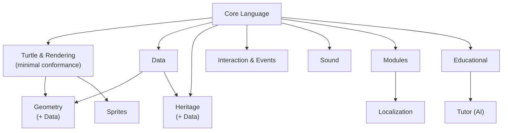
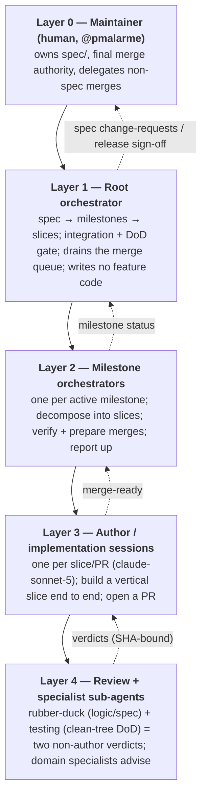
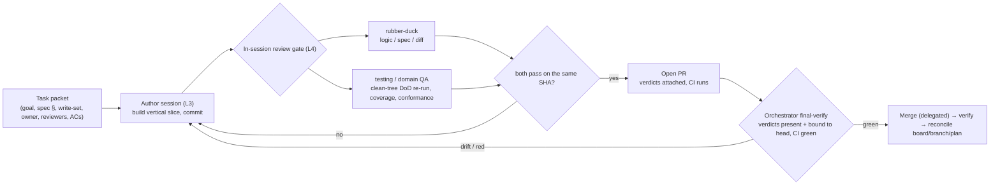
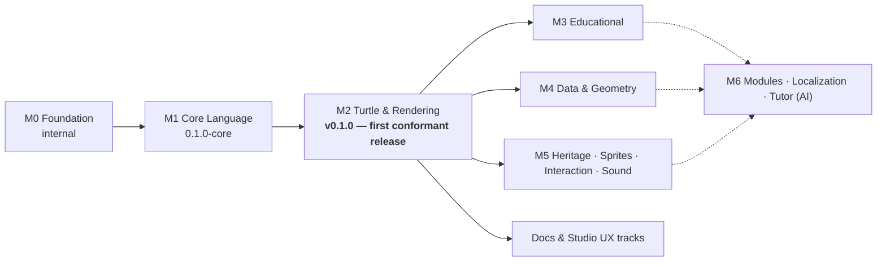

# Multi-Layer Agentic Orchestration for Implementing a New Programming Language: The OpenLogo Case Study

**Draft — prepared for the OpenLogo maintainer (@pmalarme) to finalize authorship and submit.**

*The OpenLogo Project*

---

## Abstract

Large language model (LLM) agents can write code, but shipping a *coherent, specified software
system* — rather than a pile of disconnected snippets — remains an open problem. We report a case
study in which a **new programming language**, OpenLogo (an educational, open reimagining of
Papert's Logo — a programming language and turtle-graphics engine, designed to grow a discoverable
geometry standard library and an AI tutor on top), was developed by a **multi-layer organization of
AI agents** operating on the GitHub Copilot platform. The method has three pillars: (i) a **spec-first** origin, in which a normative,
human-owned language contract is authored before any implementation and is treated as the single
source of truth; (ii) an **agent factory** — twelve specialized, persona-plus-playbook agents that
mirror the roles of a small software company, each governed by concrete step-by-step *skills*,
layered *instructions*, and a persistent cross-session *memory*; and (iii) a **five-layer
orchestration** that decomposes the specification into profile-based milestones and vertical-slice
tasks, dispatches isolated implementation sessions, and gates every change behind a
Definition-of-Done and an independent two-reviewer merge gate. We describe the architecture, the
communication model between autonomous Copilot sessions, and the concrete governance that keeps a
human in the loop for the specification while delegating routine merges to the machine. We report
quantitative outcomes measured directly from the repository: a six-package TypeScript monorepo built
across 13 profile and cross-cutting milestones and 151 merged pull requests over a five-day window.
Late in that window (2026-07-20), after 129 of those merges, the project tagged a minimally conformant
`v0.1.0` release (the Core Language and Turtle & Rendering profiles, backed by 370 stack-neutral
conformance fixtures), after which the optional profiles (Data, Geometry, and the deterministic
Educational layer) continued in parallel against the frozen contracts, with the remaining profiles —
including the AI Tutor — still planned. We also give an honest account of the failure modes we observed — chiefly a
*stale-crossing* class of coordination bug in which asynchronous inter-agent messages cross in
flight and orchestrators mis-track their own already-merged work — and the disciplines that contain
them: live-verify before acting, freeze the head commit, bind review verdicts to the full commit
SHA, and treat an explicit orchestrator-owned queue as authoritative state. We close with
threats to validity and lessons for anyone assembling agent fleets to build specified systems.

**Keywords:** LLM agents, multi-agent systems, agentic software engineering, spec-driven
development, orchestration, programming-language implementation, GitHub Copilot.

---

## 1. Introduction

The last two years have made one thing routine: an LLM agent can be handed a task and produce a
plausible patch. What is *not* routine is producing a **specified, internally consistent, and
verifiable system** — one where hundreds of independently generated changes compose into a language
that parses, evaluates, draws, teaches, and never silently contradicts its own contract. A single
"super-agent" prompted to "build a programming language" tends to drift: it invents syntax it later
forgets, re-derives semantics inconsistently across files, and has no durable notion of *done*.

This paper asks a concrete question: **can a layered organization of AI agents implement a
*specified* programming language, keeping fidelity to a normative contract while parallelizing the
work across many autonomous sessions?** We answer in the affirmative with a case study — OpenLogo —
and by dissecting the method that made it work.

Our central thesis is that the leverage does not come from a smarter single model but from
**structure around the models**: a contract to build against, a division of labor into specialist
agents equipped with executable playbooks, and an orchestration hierarchy that turns a specification
into small, reviewable, independently verifiable units of work. Concretely, the method combines:

1. **Spec-first development.** A normative `spec/` — grammar, commands, execution model, error model,
   rendering, conformance, educational model, AI-tutor behavior, tooling — is authored and owned by
   a human maintainer *before* code exists. Everything downstream implements that contract; code
   never diverges from it silently.
2. **An agent factory.** Instead of one generalist, twelve specialized agents (seven domain/package
   owners and five cross-cutting roles) act like a small studio. Each is defined not by a thin
   persona but by a bundle of **skills** (step-by-step operating procedures), **layered
   instructions** (an always-on team charter plus per-package rules), and a **persistent memory** of
   learned conventions.
3. **Multi-layer orchestration.** A five-layer hierarchy — maintainer, root orchestrator, milestone
   orchestrators, implementation sessions, and review/specialist sub-agents — decomposes the spec
   into profile-based milestones and *vertical slices*, dispatches isolated worktree-backed Copilot
   sessions to build them, and gates each merge behind a largely CI-enforced Definition of Done and an
   independent two-reviewer review gate.

We contribute: (a) a description of the orchestration architecture and its communication model
between autonomous sessions; (b) a case study mapping the architecture onto a real six-package
language implementation and its profile dependency graph; (c) quantitative results measured directly
from repository history; and (d) a candid catalog of failure modes — especially the *stale-crossing*
coordination bug — and the disciplines that contain them. Throughout, we distinguish **designed
intent** (recorded in the spec, the architecture decision records, and the agents' instructions)
from **what actually happened** (recovered from Git and GitHub history and from the orchestrators'
operational notes), because the gap between the two is itself part of the finding.

---

## 2. Background and Related Work

**Logo and constructionism.** OpenLogo descends from Papert's Logo and its constructionist
philosophy: learners discover ideas by building visible artifacts, beginning with a turtle that
draws [Papert 1980; Abelson et al. 1974]. OpenLogo keeps that spirit — turtle graphics, words and
lists, learner-defined procedures, friendly errors — while modernizing the surface (lowercase
keywords, light punctuation, `define … end` procedures) and adding optional profiles for data,
geometry, sound, interaction, localization, and an AI tutor. The choice of *domain* matters for this
paper only insofar as it is a real, non-trivial language with a graphics runtime and a pedagogy — a
system large enough that no single change could plausibly implement it, forcing the orchestration
question to the surface.

**LLM agents and multi-agent systems.** A growing body of work equips LLMs with tools, memory, and
planning to act as autonomous *agents*, and composes several of them into *multi-agent systems* that
divide labor and critique one another. Reported benefits include specialization, parallelism, and
review-by-a-second-model; reported hazards include coordination overhead, error propagation, and
context fragmentation. OpenLogo is a field report on the engineering-management end of this
spectrum: the agents are not a debating society but an *org chart* with owners, gates, and a shared
definition of done.

**Agentic software engineering.** Benchmarks and systems for autonomous software tasks have focused
largely on *isolated* problems — fix this bug, pass these tests. OpenLogo instead exercises the
*sustained, multi-milestone* construction of a coherent codebase, where the hard part is not any one
patch but keeping hundreds of patches mutually consistent and spec-faithful over time.

**Spec-driven development.** Contract-first and specification-driven methods predate LLMs, but they
acquire new force with agents: a normative spec gives every agent an unambiguous, shared ground
truth, converting "write good code" into the more checkable "implement this clause." OpenLogo treats
the spec as *normative and human-owned*, with a formal conformance model (profiles, a dependency
graph, and feature detection) that turns "is it done?" into "does the conformance suite for this
profile pass?"

Against this backdrop, OpenLogo's novelty is the **combination**: a human-owned formal contract, a
role-specialized agent factory with executable playbooks, and an explicit multi-layer orchestration
with machine-executed but human-delegated merge authority.

---

## 3. Method: The Multi-Layer Orchestration Architecture

### 3.1 Spec-first origin

Work began not with code but with a **normative specification**. The `spec/` directory is a set of
Markdown documents, each tagged Normative or Informative, using RFC-2119 requirement words. It fixes
the language's lexis and grammar (`grammar.md`), its primitive matrix (`commands.md`), its execution
and value model (`execution-model.md`), its stable diagnostic codes (`error-model.md`), rendering
and accessibility (`rendering.md`), the conformance model (`conformance.md`), the educational
baseline (`educational-model.md`), the AI tutor's guardrails (`ai-tutor.md`), and editor tooling
(`tooling.md`). Two properties make the spec the load-bearing element of the whole method:

- **It is the single source of truth.** When code and spec disagree, the spec wins; an agent that
  finds a conflict files an issue rather than diverging silently
  (`.github/instructions/openlogo-team.instructions.md`).
- **It is human-owned.** No agent — not even the product-owner — edits `spec/` directly; the
  product-owner agent may only *propose* changes through a pull request that a human reviews and
  merges, and every other agent raises
  ambiguities as change-requests. Specification authority never leaves the human.

Because the contract is explicit, downstream work becomes checkable at the clause level, and many
agents can build different parts of the language *in parallel* without renegotiating meaning.

**The contract was itself produced by the orchestration.** The specification did not spring from a
single author. According to the spec-authoring session's first-hand account, `spec/` was written by a
dedicated fleet of author sessions — roughly one per document across the seventeen Normative and
Informative Markdown files — preceded by several deliberate design pivots that moved the surface
syntax toward `define … end` blocks and toward `=`/bracketed forms before any prose was locked. A
separate integration session reconciled cross-document contracts, and multiple independent
rubber-duck reviewers re-read the actual files (not their own memory) and issued
blocking/non-blocking/nit verdicts until the cross-references reached a zero-blocking state. The human
maintainer performed the final review and merge (PR #2, squash `142551b`, 2026-07-17: 32 files,
roughly 7,500 lines; 17 documents plus 12 runnable `.logo` examples and the license). The same
layered, review-gated pattern that would later build the compiler thus also built the compiler's
contract — first evidence that the method generalizes beyond code.

### 3.2 The agent factory

Twelve agents, defined in `.github/agents/*.agent.md`, split into **seven domain/package owners** and
**five cross-cutting roles** that own no package (Table 1). Each agent is far more than a persona:
its behavior is pinned by three layers of durable context.

**Table 1. The OpenLogo agent team (12 agents).**

| Agent | Type | Owns |
|---|---|---|
| interpreter | domain | `@openlogo/core`, `@openlogo/parser` (lex→parse→AST→semantics), `@openlogo/runtime` |
| language-designer | domain | `@openlogo/parser` (grammar/EBNF, tokens, reserved words, highlighter, checker) |
| turtle-engine | domain | `@openlogo/turtle` (state, pen/heading, Canvas/SVG/PNG, animation, a11y) |
| learner-experience | domain | `@openlogo/studio` (editor/REPL, Run/Stop/Reset, LSP, lesson pane, a11y) |
| geometry-teacher | domain | `@openlogo/edu` (deterministic geometry reasoning + discoverable geometry stdlib) |
| ai-tutor | domain | `@openlogo/edu` (Socratic hints, provider-neutral AI adapter, offline degradation) |
| curriculum | domain | `@openlogo/edu` (eight learner levels, lessons, graded exercises) |
| orchestrator | cross-cutting | planning, dispatch, integration, the Definition-of-Done gate (no feature code) |
| product-owner | cross-cutting | epics/stories/acceptance criteria; spec stewardship; board, milestones, labels |
| testing | cross-cutting | stack-neutral conformance fixtures; negative/fuzz/regression/stability suites |
| documentation | cross-cutting | reference, tutorials, runnable validated examples |
| devops | cross-cutting | CI/CD pipelines, security scanning, labeler, label sync, releases |

Two co-owned package surfaces are deliberate: `@openlogo/parser` is co-owned by language-designer
(grammar and grammar-derived tooling) and interpreter (lexer, AST, evaluation), and `@openlogo/edu`
is co-owned by geometry-teacher, ai-tutor, and curriculum. Co-ownership is handled by the orchestrator
at dispatch time, not left to chance.

**Skills, not thin personas.** Each agent is backed by concrete **skill** playbooks — 29 `SKILL.md`
files under `.github/skills/`, split into seven *shared* skills every agent inherits and per-agent
skills for specialist work. Shared skills encode the universal procedures: `vertical-slice` (build a
feature end to end), `ts7-package` (monorepo conventions), `spec-fidelity` (canonical vocabulary and
`ol-*` codes), `diagnostics` (the normative error shape), `conformance-fixture` (how to write a
stack-neutral test), `review-gate` (the pre-merge review), and `definition-of-done` (the
Definition-of-Done checklist, largely CI-enforced). Per-agent skills are equally concrete — e.g. `orchestrator/decompose-and-dispatch` and
`orchestrator/integrate-and-merge`, `interpreter/implement-a-primitive` and `interpreter/ast-design`,
`language-designer/evolve-the-grammar`, `devops/ci-pipeline` and `devops/labeler-and-labels`,
`product-owner/github-project`. A skill is a numbered operating procedure with checklists, not
inspiration; it is the difference between "act like a tech lead" and "here is exactly how this team
decomposes a milestone, declares write-sets, and dispatches."

**Layered instructions.** Behavior is further constrained by an always-on team charter
(`.github/instructions/openlogo-team.instructions.md`, `applyTo: **`) plus per-package instruction
files (`applyTo: packages/<name>/**`), the repository `AGENTS.md`, and `.github/copilot-instructions.md`.
The charter states the ownership map, the Definition of Done, the spec-fidelity rules, and the
engineering principles (KISS; the Boy-Scout rule bounded to a task's declared write-set). Scoped
instructions activate automatically when an agent edits a given package.

**Persistent memory.** Finally, a cross-session **memory** captures learned conventions and hazards —
verified build/test commands, taxonomy rules, and operational war-stories (e.g. that board status
must be transitioned by hand, or that session metadata can be stale) — so a lesson learned in one
session is available to the next. Memory is what turns a fleet of stateless sessions into an
organization that accumulates experience.

### 3.3 Architecture and the profile dependency graph

The implementation is a TypeScript 7, strict-ESM monorepo of **six `@openlogo/*` packages** (ADR-0001,
`docs/architecture.md`): `core` (values, `ol-*` diagnostics, the trace/event registry, profile
metadata), `parser` (lexer, grammar, AST, highlighting, checker), `runtime` (evaluator, scope,
procedures, control forms, comprehensions, places, execution budget), `turtle` (turtle state,
rendering to Canvas/SVG/PNG, animation, accessibility), `studio` (the browser learner IDE), and `edu`
(levels, `explain`/`why`/`hint`/`debug`, geometry stdlib, tutor, curriculum). Packages depend only on
one another's public `src/index.ts` under an `OL` namespace, never internals.

Build order follows the spec's **profile dependency graph** (`spec/conformance.md`, normative). The
*minimal conforming* implementation is exactly Core Language + Turtle & Rendering; every other
profile is optional and attaches to the graph with its transitive dependencies.

**Figure 1. The profile dependency DAG.** The required minimal path is `Core Language → Turtle &
Rendering`; optional profiles fan out, with Geometry and Heritage carrying an additional dependency on
Data. Crucially, the eight learner **levels** are a *curriculum sequencing model, not profiles*
(`spec/conformance.md`): profiles are implementation capability sets, levels are a teaching order.
Conflating the two is a modeling error the spec explicitly forbids.

**Contracts agreed first.** Four **cross-cutting contracts** (ADR-0006) form the seams between
packages and are agreed in a single serialized change before any milestone's domain work fans out:
the **AST** (nodes mirror grammar productions, every node carries a source span, immutable, with a
visitor), the **trace/event stream** (a deterministic, headless, ordered event envelope with
registered kinds), the **`ol-*` diagnostics** (a normative shape — code, span, params, message,
stage, severity, did-you-mean — never ad-hoc strings), and the **token classes** (15 normative
classes derived from the grammar, not regex). Fixing the seams first is what lets rendering, tooling,
runtime, studio, and education proceed concurrently.

### 3.4 The five layers

The orchestration is a hierarchy. Work flows *down* as decomposition and dispatch; results flow *up*
as merge-ready reports and questions.

**Figure 2. The five-layer orchestration.**

- **Layer 0 — Maintainer (human).** Owns `spec/`, holds final merge authority, and *delegates* — the
  maintainer's standing instruction to the root orchestrator was, verbatim, *"You can merge and move
  ahead. I delegate to you until it is spec related."* Anything touching the specification returns to
  human review; everything else may be merged by the machine.
- **Layer 1 — Root orchestrator.** Decomposes the spec into profile-based milestones and
  vertical-slice tasks, dispatches milestone orchestrators, owns cross-milestone integration and the
  Definition-of-Done gate, and *drains a merge queue* under delegated authority. It writes no feature
  code (`.github/agents/orchestrator.agent.md`).
- **Layer 2 — Milestone orchestrators.** One per active milestone. Each decomposes its milestone into
  slices, dispatches author sessions, verifies and prepares their merges, and reports merge-ready
  status upward.
- **Layer 3 — Author/implementation sessions.** One isolated session per slice/PR, each a
  worktree-backed Copilot process (see §3.6), running on the `claude-sonnet-5` model. An author builds
  one *vertical slice* — grammar → AST → runtime + events → renderer/UI → conformance tests → teaching
  hooks → docs — and opens a pull request.
- **Layer 4 — Review and specialist sub-agents.** Before a PR opens, the author dispatches at least
  two *independent, non-author* reviewers: a logic/spec reviewer (`rubber-duck`) and a domain QA
  reviewer (`@testing` and/or the changed area's owner). Their verdicts, bound to the exact commit
  under review, are the safeguard that the implementer is *never the sole attester*.

Not every milestone required a distinct Layer-2 session; when a milestone was small the root
orchestrator sometimes acted directly at Layer 2. The layering is a *capability* hierarchy, not a
rigid headcount — what is invariant is the chain of decomposition, dispatch, independent review, and
verified merge.

### 3.5 Vertical slices, the Definition of Done, and the two-review gate

**Vertical slices.** The unit of work is one feature built through *every* layer, not a horizontal
phase. The team explicitly does not "build all the parsing, then all the runtime"; it builds one
command — spelling, tree, evaluation, drawing, test, doc — before starting the next
(`shared/vertical-slice`). One task equals one pull request, with a declared write-set.

**Definition of Done.** A change is done only when, for the artifacts it touches, it: builds and
type-checks (TS7); passes lint and format; passes unit tests; reaches **100% line/branch/function
coverage**; extends and passes the **stack-neutral conformance fixtures**; keeps the runnable
`spec/examples/*.logo` and doc examples working; passes accessibility/pedagogy checks where relevant;
updates docs and spec cross-links in the same PR; and has passed the in-session review gate
(`shared/definition-of-done`). Most of these are enforced automatically by CI (§3.7) — build,
type-check, lint, format, unit tests, conformance, runnable examples, and 100% coverage. Two of them
are not yet automated: the **integration** and **accessibility/pedagogy** gates are staged but stubbed
`TODO` in `ci.yml`, and the review gate and docs/spec cross-link updates are reviewer-run *process*
checks rather than CI jobs. We distinguish the automated from the process gates rather than claim the
whole checklist is machine-enforced.

**The two-review gate.** Every change is reviewed by two independent non-author agents before it can
merge (ADR-0004, amended by ADR-0008; `shared/review-gate`). The design evolved during the project: the
original ADR-0004 placed an independent review in the Definition of Done; ADR-0008 moved the gate
*earlier* and made it *implementer-run* — the author dispatches the reviewers in-session, iterates
until both return `pass`, and only then opens a green PR with the verdicts attached. The two roles are
(1) a **logic/spec reviewer** (`rubber-duck`) checking design, diff, and spec fidelity, and (2) a
**domain-adaptive QA** reviewer that re-runs the entire Definition of Done *from a clean tree* — a
fresh checkout — verifying that the build actually *emits* artifacts (`dist/*.js` + `*.d.ts`), that
coverage is genuinely 100%, that conformance and examples pass, and that instructions/skills/docs/spec
have not drifted. Two rules make this robust and connect directly to the failure modes of §6:

- **Verdicts are bound to a commit SHA.** A `pass` attests to one exact 40-character commit. *Any*
  later commit voids it, and the reviewers must run again on the new head.
- **A pass that contradicts CI on the same commit is void.** Reviewers reproduce the exact CI commands
  from a clean tree and paste real numbers; "should pass" is not a verdict.

The review gate is a *process step, not an automated CI job* in v1. The orchestrator performs a final
verification (both non-author verdicts present, bound to the current head; CI green) and only then
merges under delegated authority. Agents never self-merge.

**Figure 3. The slice and merge lifecycle.**

### 3.6 How the sessions are created and communicate

The platform substrate is GitHub Copilot's session model. An orchestrator provisions a new
implementation session with `create_session`, which creates a **worktree-backed feature branch** with
its own dedicated Copilot process whose working directory is the session's checkout. A *kickoff
prompt* auto-starts the session; sessions run in one of three modes — `plan`, `interactive`, or
`autopilot` — with `autopilot` used for long, self-directed slices. Sessions coordinate by
`send_session_message`; a message is delivered into the recipient session as a new *user turn*
(surfaced as a `cross_session_message`), so coordination is fully bidirectional and asynchronous. The
app maintains a parent/child tree of sessions in its sidebar. This very study was produced by such a
session: the root orchestrator created it with a kickoff prompt and the two coordinate by messages.

The upward channel matters as much as the downward one: authors report *merge-ready* status and
questions back to their milestone orchestrator, which aggregates milestone status to the root, which
in turn escalates spec change-requests and release sign-off to the human. Worktree isolation is what
makes Layer-3 parallelism safe — many sessions edit many branches without colliding, and
integration happens deliberately at merge time.

### 3.7 GitHub objects as the operating system

The team runs on GitHub primitives rather than a bespoke tracker. **Issues** are filed from templates
(feature-request, epic, feature-slice/user-story, conformance-task, foundation, bug, docs); each
template stamps a `type:*` label (two of them also pre-assign an `agent:*`), and the product-owner then
triages each issue to exactly one `agent:*` owner and one `type:*` plus the applicable
`profile:*`/`area:*`/`level:*` tags drawn from a manifest (`.github/labels.yml`, 50 managed labels; the
repository carries 64 in total because label-sync never deletes). **Milestones** are the synchronization
points on the profile DAG — M0 (Foundation) followed by the profile milestones M1–M6 (plus cross-cutting
tracks); the milestone, not a label, decides which
release a change lands in. A **Projects v2 board** ("Project #5", 206 items) with Status/Agent/Profile
fields is run by the product-owner via the `gh` CLI.

The automation that maintains these objects is real but *partial*, and honesty about the gap is part
of the method. `devops` maintains six workflows: `ci.yml` (the Definition-of-Done gate — a metadata
job that validates labels, issue forms, and agent/skill frontmatter and guards a toolchain detector,
plus code jobs for build/type-check, lint/format, unit/conformance/examples, and 100% coverage;
integration and a11y/pedagogy gates are marked TODO); `labeler.yml` (path→label PR auto-labeling, with
co-owned surfaces getting only owner-neutral `area:*` labels so a human assigns the owner); `label-sync.yml`
(reconciles repository labels *from* the manifest, creating and updating but never deleting);
`codeql.yml` and `dependency-review.yml` (security scanning); and `add-to-project.yml`. The last is
*designed* to auto-add issues and PRs to the board but is inert until a maintainer provisions a secret,
and board **Status** transitions (Todo→In Progress→Done) are performed *by hand* by orchestrators — a
step that was, in practice, sometimes missed. We report this because the boundary between automated and
manual is exactly where coordination bugs live (§6).

---

## 4. Case Study: OpenLogo

### 4.1 Sequencing: M0 → M1 → M2, then parallel

The milestones are profile-based synchronization points on the dependency graph (`docs/delivery.md`).
The first three ran essentially in sequence, because each is a prerequisite for the next:

- **M0 — Foundation.** The workshop before the work: the monorepo skeleton, the TS7 toolchain and CI,
  the conformance harness, the backlog and labels, the agent team, and the cross-cutting contract
  stubs (AST/events/diagnostics/token-class enums with no behavior yet).
- **M1 — Core Language.** The language itself, before any turtle: lexer, reader, parser, AST,
  evaluator, runtime, `define … end` procedures, every control form, the three comprehensions
  (`map`/`filter`/`reduce`), the Core reporter set, and `ol-*` diagnostics — built as a *walking
  skeleton*, the thinnest end-to-end version of every layer before any layer got rich. M1 carried the
  internal marker `0.1.0-core`.
- **M2 — Turtle & Rendering.** Turtle state and events, Canvas rendering with SVG/PNG export, and the
  studio Run/Stop/Reset loop with a turtle view and accessibility. Core + Turtle & Rendering is the
  **minimal conformance** path, so M2 is the flagship: at M2 the first lockstep release, **`v0.1.0`**,
  was tagged.

After M2, the *optional* profiles parallelize. Milestones M3 (Educational), M4 (Data & Geometry), and
M5 (Heritage · Sprites · Interaction & Events · Sound) proceed concurrently against the frozen
contracts, alongside cross-cutting tracks such as documentation ("Learn How It's Built") and studio
UX. A milestone completes only when its profile conformance is green across *all* domains — engine,
tooling, rendering, studio, education, tests, and docs — not when a single package finishes.

**Figure 4. Milestone sequencing (the release ladder).** Sequential through the minimal-conformance
release (`v0.1.0` at M2), after which the optional-profile milestones proceed in parallel and are
sequenced toward the planned M6. The dotted edges are *release ordering, not profile dependencies* —
the normative dependency graph is Figure 1 (where, among these, only Tutor depends on Educational).

### 4.2 Spec fidelity as a first-class constraint

Because a human-owned contract exists, "spec fidelity" is enforceable rather than aspirational. The
canonical language is deliberately *not* classic Logo: lowercase keywords; `define … end` with
`return` for procedures (the classic `to`/`output` spellings are an optional *Heritage* profile);
underscored turtle commands (`forward`/`right`/`pen_up`, with `fd`/`rt`/`pu` again Heritage); `=` and
`set … to` assign while `==` compares; `:name` variables; and geometry exposed as *discoverable
OpenLogo source* (the `polygon` family is standard-library `.logo`, not an opaque primitive) so that
learners still discover `repeat`, turns, and `define`. The `spec-fidelity` shared skill and the
`ol-*` diagnostic registry make deviations detectable in review and CI, not merely discouraged.

Two clauses show why fidelity here is pedagogical, not cosmetic. Geometry is required to stay
*readable*: "Most of geometry is a derived standard library written in OpenLogo, not a hidden set of
opaque primitives; the `grid`, `axes`, and `measure` overlays are the exception — they are
renderer-backed primitives specified behaviorally rather than as OpenLogo source"
(`spec/geometry-module.md`). And the teaching commands are constrained to protect discovery: the
Educational profile's `hint` "MUST be progressive … and MUST NOT reveal a full solution on its first
request," while the AI Tutor "MUST ask guiding questions before" answering and "MUST degrade
gracefully to that Educational baseline" when the AI backend is unavailable (`spec/conformance.md`).
An implementation that shipped `polygon` as a hidden primitive, or a tutor that printed a finished
program, would compile and pass its unit tests yet violate the contract — precisely the class of
error the fidelity gate exists to catch.

---

## 5. Results

All figures below were measured from the repository on 2026-07-21. Release-artifact counts (fixtures,
examples, packages) are read from the deterministic `v0.1.0` tag; project-activity counts (commits,
merged PRs, issues, board items) are read from `origin/main` at commit `ddf04c3` via `git` and the
GitHub CLI (`gh`) and *continue to grow* as the optional-profile milestones proceed — they are a
partial, still-growing window, not a closed total. Daily buckets are UTC, and `gh` list commands used
explicit `--limit` bounds so counts are not silently truncated by pagination.

**Table 2. Quantitative outcomes.**

| Metric | Value | How measured |
|---|---:|---|
| `@openlogo/*` packages | 6 | `packages/` layout; ADR-0001 |
| Specialized agents | 12 | count of `.github/agents/*.agent.md` |
| Skill playbooks | 29 | count of `.github/skills/**/SKILL.md` |
| Architecture Decision Records | 12 | `docs/adr/0000..0011` |
| CI/automation workflows | 6 | `.github/workflows/*.yml` |
| Issue templates | 7 | `.github/ISSUE_TEMPLATE/*.yml` (excl. `config.yml`) |
| Labels (managed in manifest / total in repo) | 50 / 64 | `grep -c '{ name:' .github/labels.yml`; `gh label list --limit 1000` |
| Stack-neutral conformance fixtures | 370 in `v0.1.0` · 409 at `ddf04c3` | `git ls-tree -r --name-only <ref> -- tests/conformance` (per ref) |
| Spec example programs | 12 | `spec/examples/*.logo` |
| Commits on `main` | 152 | `git rev-list --count ddf04c3` |
| Merged pull requests | 151 | `gh pr list --state merged --search "merged:<=2026-07-21" --limit 1000` |
| Issues (open / closed) | 32 / 175 | `gh issue list --state all --limit 1000` (2026-07-21; open count grows) |
| Project board items | 206 | `gh project item-list 5` |
| Milestones (profile + cross-cutting) | 13 | `gh api …/milestones` |
| Tagged releases | 1 (`v0.1.0`) | `git tag` |

**Timeline and throughput.** The first commit landed 2026-07-16; the first PR merged 2026-07-17; the
`v0.1.0` release commit is dated 2026-07-20; the most recent merge in our window is 2026-07-21. Merged
PRs per day were 12 / 45 / 56 / 26 / 12 across 2026-07-17…21 (UTC; the last bucket keeps growing after
measurement) — a pronounced burst reflecting Layer-3 parallelism once the M0 contracts were frozen. The **minimal
conformant language therefore went from empty repository to tagged, conformance-backed `v0.1.0` in
roughly four days** of agent-driven work.

**Work distribution across milestones.** Closed issues per profile milestone were M0 = 4, M1 = 81,
M2 = 36, with M3 = 9 (of 17), M4 = 5 (of 12), and M5 = 0 (of 3) in progress at time of measurement;
cross-cutting tracks (documentation, servable studio, studio UX, stepper/debugger) account for the
remainder. The concentration in M1 (the Core Language) reflects the walking-skeleton strategy: the
language's semantic core was the largest body of vertical slices, after which turtle, education, and
data profiles reused the frozen contracts.

**What shipped.** A minimally conformant OpenLogo: the full Core language (lexing, AST, evaluation,
procedures, all control forms, all three comprehensions, the Core reporter set, `ol-*` diagnostics),
runnable in a studio REPL; a turtle that draws to Canvas with SVG/PNG export; a grammar-faithful
highlighter and checker; the conformance harness that gates `v0.1.0` with 370 fixtures (0 skipped);
and — on the in-progress optional profiles — the first educational lessons and geometry work. Correctness is carried by the
conformance fixtures rather than by prose, per the Definition of Done.

---

## 6. Discussion

### 6.1 What worked

**Contracts-first parallelism.** Freezing the AST, event stream, diagnostics, and token classes before
fanning out is, on our operational read, what let the mid-window burst (a peak of 56 merged PRs in one
UTC day) land without incoherence — though we cannot prove causation without a controlled comparison
(§7). Agents built against stable seams; integration was a deliberate merge-time event, not a running
negotiation.

**Vertical slices bounded blast radius.** Because each PR was one feature through every layer with a
declared write-set, a failure was usually contained to a slice and its reviewers. `main` was kept
close to releasable — though not perfectly: on three occasions a merge briefly turned it red on the
100%-coverage job (a post-merge integration race; see §6.2), each promptly repaired.
The single large bootstrapping PR that seeded the lexer/parser/AST is called out in the orchestrator's
own playbook as a *one-time exception, not a template* — the team knew large PRs were a smell.

**The two-review gate caught what CI could not.** ADR-0004's motivating examples are instructive: a
green pipeline can still hide a stale `.tsbuildinfo` that makes a build a silent no-op, or a coverage
number that is 100% only because test files bypassed the public API. The clean-tree, artifact-emitting
re-run by a *second, non-author* agent is precisely aimed at these. The project also learned to make
verdicts answerable to reality: a self-review `pass` that contradicts CI on the same commit is treated
as void.

**Human-in-the-loop where it counts.** Delegating routine merges to the machine while keeping the
*specification* human-gated concentrated scarce human attention on the one artifact whose integrity the
whole method depends on. The maintainer could let hundreds of PRs flow and still guarantee that the
contract never changed without review.

### 6.2 Failure modes

**Stale-crossing.** The dominant coordination hazard is what we call *stale-crossing*: because
inter-session messages are asynchronous and each session's view of the world is a snapshot, an
orchestrator can act on a world that has already changed. Observed instances include an orchestrator
tracking *its own already-merged work* as still-pending because a merge notification and a status query
crossed in flight; review verdicts rendered void because a "final" head moved when the author pushed one
more polishing commit after the gate was dispatched; and session metadata reported as idle/stale by the
app while the underlying worktree was in fact advancing. The through-line is that **any cached view — a
message, a metadata field, a remembered SHA — may be stale by the time it is used.**

The disciplines that contain stale-crossing are consistent:

- **Live-verify before acting.** Never act on a remembered state; re-query ground truth with `git`/`gh`
  first. The reliable liveness signal for a local session proved to be its *worktree Git state*
  (commits ahead of `origin/main`, dirty files), not the app's cached session metadata.
- **Freeze the head SHA and bind verdicts to it.** A review `pass` attests to one 40-character commit;
  a later commit voids it. Correspondingly, one waits for a *single, final* confirmed push before
  freezing a head and dispatching the gate, rather than gating a head that is still moving.
- **Treat an explicit, orchestrator-owned queue as authoritative state.** Rather than trusting message
  history, the orchestrator keeps its merge-queue and drain state in a structured store it controls, so
  "what is merged / merge-ready / pending" has one authoritative answer that does not depend on whether
  an async message arrived.

**Post-merge integration races.** Per-PR green CI does not guarantee a green `main`. On three occasions
an independently green PR merged onto a base that had moved under it and briefly turned `main` red on
the 100%-coverage job — the coverage denominator shifted once the two changes were combined (measured
from the CI run history: three failing runs on `main` out of 150, all in the coverage job). Each was
repaired quickly, but the pattern is *stale-crossing at the repository level*: a change verified against
a base that is already stale by merge time. A required up-to-date branch, serialized merges, or a
mandatory post-merge re-run mitigate it.

**Manual board hygiene.** Because `add-to-project` is inert without a secret and Status is moved by
hand, the board drifted from reality when a busy orchestrator forgot to advance a dispatched issue from
Todo to In Progress, or a merged one to Done. The lesson is narrow but real: a step that is *designed*
to be automated but is *actually* manual is a reliable source of drift, and should either be automated
or explicitly checklisted.

**Coordination hazards between concurrent agents.** Two sharper edges appeared. First, dispatching a
clean-tree QA reviewer *against the same worktree the author is still editing* is dangerous: a reviewer
that "cleans" what it sees as stray diffs (`git checkout --`/`git stash`) can discard the author's
in-progress fix. Reviews must run against committed, isolated state. Second, rebasing a *stacked* PR
requires verifying that the stacked head does not still carry pre-rework parent commits, lest a replay
resurrect content that a parent had already reworked away. Both are instances of the same root cause as
stale-crossing: reasoning about a moving target from a stale snapshot.

**Warm-session restart latency.** Re-tasking an idle session for a *new* slice sometimes only performed
the Git sync and branch creation and then idled; it needed a second explicit "begin now" instruction to
start building. Dispatch, in other words, is not always idempotent, and the orchestrator must confirm
that a dispatched session actually *started*, not merely acknowledged.

### 6.3 Why the structure, not the model, is the lesson

None of the above is about a cleverer base model. The wins came from *structure* — a contract, an org
chart, executable playbooks, a hard definition of done, and an independent review gate — and the
failures came from the *seams between autonomous processes*, which is exactly where classical
distributed-systems intuition (stale reads, lost updates, the need for a single source of truth) turns
out to apply to fleets of LLM agents. The practical upshot is that building with agent fleets is, in
large part, a *coordination-engineering* problem wearing a prompt-engineering hat.

---

## 7. Threats to Validity

**Construct validity.** Our headline metrics (merged PRs, fixtures, coverage) measure *activity and
gating*, not external code quality or learner outcomes. 100% coverage and green conformance are strong
internal signals but do not by themselves establish that OpenLogo is pedagogically effective or
bug-free in the field.

**Internal validity.** We cannot fully separate the contribution of the orchestration from that of the
underlying model, the specific human maintainer's judgment, or the GitHub Copilot platform's
affordances. The `v0.1.0` result is one trajectory, not a controlled comparison against a single-agent
baseline; we make no claim about *how much* faster or better the layered approach is, only that it
*sufficed* to ship a specified language and that its failure modes are characterizable. We also
describe the two-review, SHA-bound merge gate as the policy the project *converged on*, not as an
audited property of every PR: ADR-0004 (17 July) mandated one independent review, and ADR-0008
(18 July) tightened it to two non-author reviews bound to the full head SHA. Early PRs predate that
final gate — some recorded only abbreviated SHAs — and per-PR compliance is self-reported on PR
bodies rather than independently verified here across all 151 merges.

**External validity.** OpenLogo is a mid-sized, greenfield, well-specified educational language with an
unusually crisp conformance model. The method leans heavily on the *existence of a normative spec*;
domains without a natural contract, or brownfield systems with heavy legacy constraints, may not
transfer cleanly. The five-day window is short and intense; sustained multi-month operation may surface
different dynamics (memory bloat, drift, reviewer fatigue analogues).

**Measurement validity.** Counts were taken at a single instant from a live repository with milestones
still in progress; per-milestone figures in particular will change. We mitigate by reporting the exact
`git`/`gh` command class for each number and by dating the snapshot. A known measurement subtlety — that
the 100% coverage gate is only faithful under the pinned Node 22, because newer Node versions silently
exclude test files from the denominator — is itself an artifact the team had to discover and encode,
and a caution against trusting a green number without knowing how it was produced.

---

## 8. Conclusion

OpenLogo is evidence that a **layered organization of AI agents can implement a *specified* programming
language** — parser, runtime, turtle graphics, tooling, and the beginnings of an educational layer —
while preserving fidelity to a human-owned contract. The method's leverage is structural: a spec-first
contract as the single source of truth; an agent factory of role-specialized agents armed with
executable skills, layered instructions, and durable memory; and a five-layer orchestration that turns
the spec into profile-based milestones and vertical slices, gates every change behind a Definition of
Done and an independent two-reviewer review, and merges under human-delegated but human-bounded
authority. In four days of agent-driven work the project went from an empty repository to a tagged,
conformance-backed minimal release, at a peak throughput of dozens of merged pull requests per day that
we operationally attribute to freezing cross-cutting contracts before parallelizing (§7).

The honest other half of the story is that autonomy at the seams is where the bugs live. *Stale-crossing*
— acting on a snapshot that has already moved — and its cousins (voided verdicts, drifting boards, WIP
clobbered by an over-eager cleaner) are coordination failures, not reasoning failures, and they are
contained by classical disciplines: live-verify, freeze and bind to a commit SHA, and keep one
authoritative, orchestrator-owned record of state. For practitioners assembling agent fleets, the
takeaway is that the prompt is the easy part; the org chart, the contract, the gate, and the treatment
of state as a distributed-systems problem are what make the difference between a pile of patches and a
language that runs.

---

## References

1. S. Papert. *Mindstorms: Children, Computers, and Powerful Ideas.* Basic Books, 1980.
2. H. Abelson, N. Goodman, and L. Rudolph. *The LOGO Manual.* MIT AI Memo AIM-313, 1974.
3. A. Stefik and S. Siebert. "An Empirical Investigation into Programming Language Syntax." *ACM
   Transactions on Computing Education*, 2013.
4. The OpenLogo Project. *OpenLogo Specification v0.1.0 (Draft)* and repository artifacts:
   `spec/`, `docs/architecture.md`, `docs/delivery.md`, `docs/adr/0000–0011`,
   `.github/agents/*.agent.md`, `.github/skills/**/SKILL.md`,
   `.github/instructions/openlogo-team.instructions.md`, `.github/workflows/*.yml`. 2026.

---

*This is a working draft grounded in the OpenLogo repository as of 2026-07-21. Metrics reflect a
single snapshot of a live project and will evolve; architectural claims cite repository files. Intended
for the maintainer (@pmalarme) to finalize and publish externally.*
