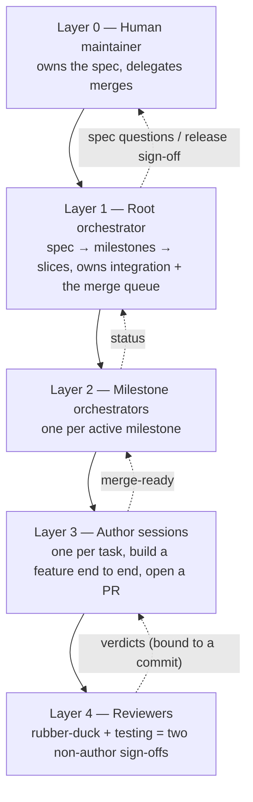
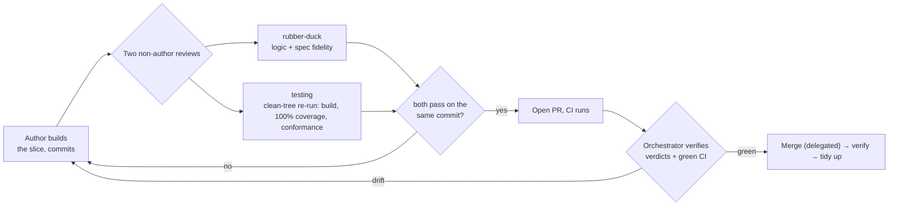
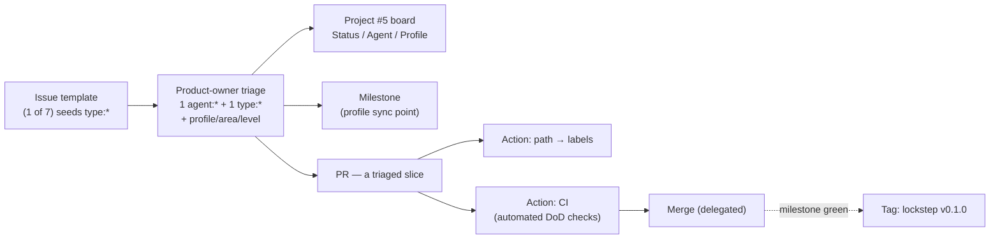

# We didn't build a programming language with one AI agent. We built an AI *company* — and let it ship.

*How OpenLogo — a new educational programming language with turtle graphics (and, by design, a
discoverable geometry standard library and an AI tutor layered on top) — was built by a multi-layer
fleet of GitHub Copilot agents, and what actually happened when we let them review and ship each
other's work.*

---

Here's a number to sit with: **from an empty repository to a tagged, test-backed `v0.1.0` of a brand-new
programming language in about four days.** Not a toy. A real language — lexer, parser, evaluator,
turtle graphics that draw to a canvas, a syntax highlighter, an error checker, and 370 conformance
tests proving it behaves.

The twist: almost none of it was typed by a human. It was built by a **team of AI agents** organized
like a small software company — a product owner, a language designer, an interpreter engineer, a
turtle-graphics engineer, testers, docs writers, a DevOps engineer, and a tech-lead orchestrator
coordinating them all. A human owned exactly one thing — the language *specification* — and delegated
the rest.

This is the story of how that worked, the structure that made it possible, and the genuinely hard
parts nobody warns you about.

## Why not just one big agent?

The obvious approach is to prompt one powerful model: "build me a programming language." Try it and
you'll watch it drift. It invents a syntax on page one and forgets it by page ten. It re-derives the
same semantics three inconsistent ways. It has no durable idea of *done*, so it declares victory on
code that doesn't compile.

A programming language is not a snippet. It's hundreds of interlocking decisions that all have to
agree with each other — forever. One agent holding all of that in a single context window is a recipe
for incoherence.

So we did the opposite of "one big brain." We built an **org chart.**

## The agent factory

Twelve specialized agents live in the repo as `*.agent.md` files. Seven own a slice of the code:

- **language-designer** — the grammar and keywords
- **interpreter** — the lexer, the syntax tree, the evaluator, the runtime
- **turtle-engine** — everything that moves and draws
- **learner-experience** — the browser app you actually type into
- **geometry-teacher**, **curriculum**, **ai-tutor** — the teaching layer

Five more own no code but hold the team together: **orchestrator** (the tech lead), **product-owner**
(the backlog and the spec), **testing** (proves it works), **documentation**, and **devops** (the CI
pipelines and releases).

But here's the part people get wrong. A good agent is **not a thin persona.** "Act like a tech lead"
is useless. What actually works is giving each agent three things:

1. **Skills** — 29 concrete, step-by-step playbooks (`SKILL.md` files). Not vibes — numbered
   procedures with checklists. "How this team decomposes a milestone." "How to implement a primitive
   end to end." "How to run the review gate." An agent doesn't *improvise* the workflow; it *follows*
   one.
2. **Layered instructions** — an always-on team charter (ownership, the definition of done, the coding
   rules) plus per-package rules that switch on automatically when an agent touches that package.
3. **Memory** — a persistent, cross-session store of hard-won lessons. When one session learns that
   the coverage gate only behaves under a specific Node version, or that the board status has to be
   moved by hand, the *next* session already knows. That's what turns a swarm of forgetful sessions
   into an organization that accumulates experience.

Skills + instructions + memory is the difference between "an LLM that writes code" and "a teammate who
knows how *this* team ships."

## Spec-first: the one thing a human refused to delegate

Before a single line of code, the team wrote a **normative specification** — the grammar, the commands,
the execution model, the error codes, the rendering rules, the conformance profiles, the teaching
model. Every `MUST` and `SHOULD` spelled out.

Here's the twist: the spec itself was built by the *same* agent factory. A fleet of author sessions,
roughly one per document, drafted the seventeen files; an integration session reconciled them; and
independent reviewers re-read the actual text until zero blocking issues remained. Then the human
maintainer did the one thing no agent was allowed to do — reviewed it and merged it. (PR #2:
seventeen documents plus twelve runnable examples, ~7,500 lines.) The humans didn't type the whole
contract; they *owned* it.

That spec is the **single source of truth.** When code and spec disagree, the spec wins — full stop. An
agent that spots a conflict files an issue; it does not quietly "fix" the language. And critically:
**no agent changes the spec unilaterally.** Even the product-owner can only *propose* a change, as a
pull request a human reviews and merges.

This one rule is load-bearing. It means hundreds of parallel changes can fly by, and the maintainer can
still guarantee the *contract* never moved without a human saying so. It converts a fuzzy instruction
("write good code") into a checkable one ("implement clause 4.2"). Agents stop negotiating meaning and
start implementing it.

## The layered orchestra

Here's the shape of the whole thing:

Work flows **down** as decomposition; results flow **up** as "this is ready to merge." The root
orchestrator turns the spec into *milestones* (grouped by capability profile) and each milestone into
*vertical slices* — one feature built all the way through: grammar → tree → evaluator → drawing → tests
→ docs. Not "all the parsing, then all the running." One whole cupcake at a time, not a tray of batter.

Each slice becomes its own **isolated Copilot session** — a dedicated git worktree with its own branch
and its own agent process, kicked off with a prompt and left to run in autopilot on Claude Sonnet 5.
Many of these run at once without stepping on each other, because each lives on its own branch.
They coordinate by sending each other messages, which land as new turns in the other session's
conversation. (This very post was written by one such session, dispatched by the orchestrator and
reporting back to it.)

(Heads-up for later: it didn't *start* this layered. For the first three milestones there was just one
orchestrator dispatching authors and merging them; the middle tier of milestone orchestrators only
appeared once the parallel profile work did — and it turned out to have a cost. More in "The honest
hard parts.")

## The gate: nobody merges their own unreviewed work

Speed is worthless if `main` breaks. So every change has to clear a **Definition of Done** and an
**independent two-reviewer gate** before it can merge.

The Definition of Done is strict: it builds and type-checks, lint and format pass, **100% test
coverage**, the stack-neutral conformance fixtures pass, the runnable examples still run, and the docs
are updated *in the same PR*. Most of that is enforced automatically in CI — build, types, lint,
format, tests, conformance, examples, coverage. A couple of gates (integration, accessibility) are
still stubbed `TODO`, and the two-reviewer step below is a *process* gate, not a CI job.

Then two **independent** agents review — and neither is the author. One (`rubber-duck`) checks the
logic and spec fidelity. The other (`testing`) re-runs the *entire* Definition of Done **from a clean
checkout**, because a green pipeline can lie — a stale build cache can make "build" a silent no-op, and
coverage can read 100% only because tests cheated past the public API. A fresh, artifact-emitting re-run
by a second pair of eyes catches exactly that.

One detail matters more than it looks: **verdicts are bound to a specific commit.** A "pass" approves
*that exact commit*. Push one more commit and the approval is void — you review again. The
implementer is *never* the only one attesting that the work is good. (This two-reviewer, commit-bound
gate wasn't there on day one — an early version used a single reviewer, and the team tightened it into
the two-review rule within the first days.)

Only then does the orchestrator merge — under authority the maintainer explicitly delegated: *"You can
merge and move ahead. I delegate to you until it is spec related."* Anything touching the spec goes back
to the human. Everything else, the machine ships.

## GitHub *is* the operating system

Here's the part most "AI builds software" demos skip: the agents didn't run on a bespoke task queue
or some magic shared brain. **They ran on plain GitHub** — issues, labels, milestones, a project board,
Actions, and tags. Every one of those is already a durable, queryable, permissioned source of truth that
agents *and* humans read the same way.

Here's how one unit of work actually moves through them:

**Issues are the unit of work — and they're typed.** You don't open a freeform issue; you fill a
**template** (feature-request, epic, feature-slice/user-story, conformance-task, foundation, bug, docs).
Each template stamps the issue with its **`type:*`** (a couple also pre-assign an `agent:*`); then the
product-owner triages it to exactly **one `agent:*` owner** and **one `type:*`**, plus the
`profile:*`/`area:*`/`level:*` tags that apply. That's how a fuzzy idea becomes a *routable, owned* task:
the owner label says who builds it, the milestone says which release it's for.

**Labels are a manifest, not vibes.** The managed taxonomy — 50 labels — lives in one file,
`.github/labels.yml`, and an Action (`label-sync`) reconciles the repo *from* that file: create and
update, **never delete**. No agent invents a managed label live, so the taxonomy can't drift — though
because sync never deletes, a few default/stray labels do accumulate (the repo carries 64 in total).

**Milestones are the profile sync points.** M0 lays the foundation; **M1→M6** each reach a capability
profile — and the *milestone*, not a label, decides which release a change ships in. A milestone is
"done" only when its profile is conformance-green across every domain at once, not when one package
finishes.

**The board is the orchestrator's radar.** A Projects v2 board ("Project #5", ~206 items) with
Status / Agent / Profile fields, driven straight from the `gh` CLI. Around it, **six Action workflows**
keep things honest: `ci` (the automated DoD checks — build, lint, tests, coverage, conformance),
`labeler` (path→label auto-labeling), `label-sync`, `codeql` + `dependency-review` for security, and
`add-to-project`.

**Tags are lockstep releases.** When Core + Turtle went conformance-green, the whole `@openlogo/*`
package set was tagged *together* as **v0.1.0** — one version tuple, one spec version, a declared set of
profiles. A tag isn't "whatever happens to be on `main`"; it's a green, coherent snapshot you can point
a learner at.

**And it's the orchestrator's source of truth — not its memory.** This is the part that matters most.
The orchestrator doesn't decide what's done by reading its plan or its notes; it asks GitHub. What's
merged, what's in flight, what's ready — re-derived from `git` and `gh` every time, because its own
memory goes stale the instant another session merges something. That literally happened: one morning a
plain `git log` showed **four PRs already merged that the orchestrator had never recorded** — the
maintainer had been merging in parallel — and GitHub, not the plan, was right. So the roles are clean:
the **board is the maintainer's window** into progress, **issues and PRs are the traceability** trail,
and **git's refs are the source of truth** that overrules any agent's memory.

And — keeping the promise to be honest — this is where real gaps live. `add-to-project` needs a secret
that wasn't always set, so new issues weren't always auto-added *at all*. And even when it runs, it only
ever files a card as *Todo* — nothing advances it, so every Status move (Todo → In Progress → Done) is
done **by hand**. Both are why the board sometimes drifted. More on that now.

## The honest hard parts

If I stopped here it'd be a commercial. The real story includes the failures — and they're the most
useful part.

**Stale-crossing.** This was the big one. Sessions talk asynchronously, and each one acts on a
*snapshot* of the world. So messages cross in flight and agents act on a past that's already gone. We
watched an orchestrator track *its own already-merged work* as still-pending, because a "done" message
and a status check passed each other on the wire. We watched review sign-offs get silently voided
because someone pushed "one more small commit" after the reviewers had started. We watched the app
report a session as idle while its worktree was, in fact, busy.

The fix isn't cleverer prompts — it's **classic distributed-systems discipline**:

- **Live-verify before you act.** Never trust a remembered state; re-check ground truth with `git` and
  `gh` first. The truth was always the actual branch, never a cached status field.
- **Freeze the commit and bind decisions to it.** Wait for one final push, *then* review; a moving head
  invalidates everything downstream.
- **Keep one reconciled ledger.** The orchestrator tracks its merge queue in a structured store it
  owns, so "what's merged vs. pending" has one working answer that doesn't depend on which message
  arrived when — while still treating GitHub, not that store, as the source of truth it reconciles
  against.

**Manual board hygiene.** Two independent gaps here. The board's auto-add automation needs a secret that
wasn't always set — so new cards sometimes weren't added *at all*. And even when it runs, that automation
only ever files a card as *Todo*; nothing advances it, so moving cards Todo → In Progress → Done was
*always* manual — and busy orchestrators forgot. The lesson is dull but real: a step you *think* is
automated but actually isn't is a reliable source of drift. Automate it or checklist it.

**Over-eager cleaners.** One sharp edge: never point a "clean-tree" reviewer at a worktree the author is
still editing — a reviewer that tidies up "stray" changes can `git checkout` away the author's
in-progress fix. Reviews run against committed, isolated state, always.

Notice the pattern: none of these are *reasoning* failures. They're *coordination* failures — the exact
bugs distributed systems have had for decades, now wearing an LLM costume.

### One orchestrator, then a whole hierarchy — and it wasn't free

Here's a twist the metrics hide: the biggest burst of shipping happened *before* the fancy hierarchy
existed. The first three milestones — everything up to and including the tagged **v0.1.0** — ran under a
*single* root orchestrator dispatching author sessions and merging them one at a time. That
56-PRs-in-a-day peak? Single orchestrator. The milestone-orchestrator tier only appeared *minutes*
after v0.1.0 shipped, to soak up the parallel profile work that came next. (The later days show fewer
merges — but that's not apples-to-apples: the optional-profile work was a smaller body than the
Core-language burst, and it's later in the calendar. Topology isn't the controlled variable here.)

And the extra tier came with a bill. The root is one funnel that every milestone reports into, so it
**repeatedly compacts its own conversation context** just to stay under its context limit — and the token cost climbs,
because each milestone orchestrator keeps its own context and the root re-checks their verdicts from
scratch. It also *created* work: more coordination chores, more verdict re-stamping, more chances to act
on a stale commit. So the honest question the maintainer is left asking: would **several independent
orchestrators, each owning a disjoint chunk of the code over one thin merge gate**, have been leaner
than a deep hierarchy? The maintainer's own hunch is *probably* — *except* the code doesn't partition cleanly. The syntax tree, the
event registry, the error codes, the shared evaluator — they all get touched from everywhere, so
*someone* still has to own a single integration gate. Tellingly, the orchestrator's own read is that
once the parallel rush subsided, the maintainer pulled the whole thing back to one PR at a time.

Two smaller versions of the same lesson:

- **Slices that were too big.** The very first lexer/parser/AST slice landed as one ~3,600-line marathon
  PR (#35) — so hard to review that the team wrote a "keep slices small" rule (#42) rather than ever do
  that again. In the maintainer's retrospective, oversized slices still cropped up once milestone
  orchestrators were cutting the work — a slice cut too big stalls at the review-and-merge gate and has
  to be re-decomposed.
- **Shared seams that refuse to parallelize.** Three Data features all had to edit the same
  evaluator-dispatch file, so they queued behind each other instead of running in parallel. Worse, a
  command wired into the parser but not the runtime silently did *nothing* — no error at all — and it
  happened *twice*, because two parallel sessions each owned one half of the contract.

## What actually shipped

Measured straight from the repo (as of this writing, 2026-07-21):

- **6** packages, **12** agents, **29** skill playbooks, **12** architecture decision records, **6** CI
  workflows.
- **151** merged pull requests; the tagged **`v0.1.0`** shipped **370** conformance fixtures (the tree
  has kept growing past 400 since).
- Merge throughput once the shared contracts were frozen: **12 → 45 → 56 → 26 → 12** PRs a day (UTC).
- A tagged, minimally conformant **`v0.1.0`** — Core language + turtle graphics that really draws — with
  Educational, Data, and Geometry profiles now building *in parallel* on top.

The burst is the tell — and our best operational read of what drove it. It came *after* the team froze
four cross-cutting contracts — the syntax tree, the event stream, the error codes, and the highlighter's
token classes — up front. Agree the seams first, and many agents can build behind them at once without
colliding.

## The takeaway for anyone building with agent fleets

The seductive idea is that a smarter model is all you need. OpenLogo's lesson is the opposite: **the
model was the easy part.** The leverage came from *structure* —

- a **human-owned contract** so "good code" becomes "implements the spec,"
- an **org chart** of specialist agents with real playbooks, not thin personas,
- a **hard definition of done** and an **independent review gate** so speed never costs correctness,
- and treating **shared state as a distributed-systems problem**, because that's exactly what it is once
  your agents run in parallel,
- and **right-sizing the hierarchy** — in this project the extra orchestration layer added token and
  relay overhead, which suggests adding layers only when parallel load demands them, and flattening
  again when it doesn't.

Prompt engineering gets you a patch. *Coordination* engineering gets you a language that runs. If you're
assembling an agent fleet, spend your time on the contract, the gate, and the org chart — and respect the
seams between your autonomous processes, because that's where the bugs live.

OpenLogo is open source. Go read the `.github/agents/` folder and count the specialists — then see if you
can match each one to the part of the language it owns.

---

*Built by the OpenLogo agent fleet on GitHub Copilot. Numbers are a snapshot from a live repo and will
keep moving — which, honestly, is the point.*
